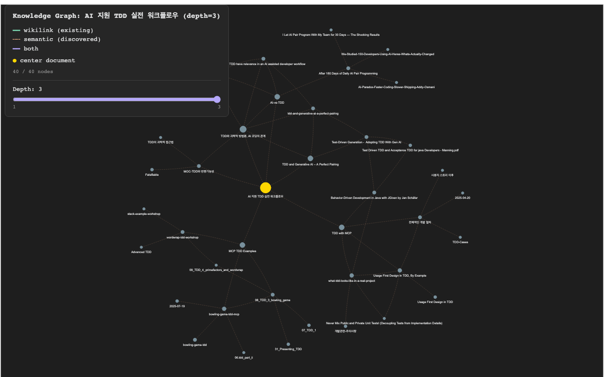

# Vault Intelligence - Semantic Search for Obsidian

Obsidian vault를 위한 로컬 시맨틱 검색 엔진. BGE-M3 임베딩 기반으로 Dense, Sparse, ColBERT, Cross-encoder Reranking을 결합한 다층 하이브리드 검색을 제공합니다. 한국어 최적화 포함.

변경 이력은 [CHANGELOG](CHANGELOG.md)에서 확인할 수 있습니다.

## Quick Start

```bash
# 설치 (pipx 권장)
pipx install -e ~/git/vault-intelligence

# Vault 초기화 및 인덱싱
vis init --vault-path ~/my-vault
vis reindex

# 검색
vis search "TDD"                              # 하이브리드 검색 (기본)
vis search "TDD" --search-method semantic     # 의미적 검색
vis search "TDD" --search-method keyword      # 키워드 검색
vis search "TDD" --search-method colbert      # ColBERT 토큰 검색
vis search "TDD" --rerank                     # Cross-encoder 재순위화 (최고 품질)
vis search "TDD" --rerank --expand            # 재순위화 + 쿼리 확장 (최대 포괄)

# 관련 문서 찾기
vis related "문서명.md" --top-k 10

# 자동 태깅
vis tag "문서명.md"
vis tag "폴더명/" --recursive

# MOC(Map of Content) 생성
vis generate-moc "TDD" --top-k 50

# 주제별 문서 수집
vis collect "TDD" --output collection.md

# 주제별 문서 연결 (MOC + 관련 문서 링크 삽입)
vis connect-topic "TDD" --dry-run    # 미리보기
vis connect-topic "TDD"              # 실행

# 문서 관계 그래프 시각화
vis graph "문서명.md" --top-k 10     # 인터랙티브 HTML 그래프 생성
vis graph "문서명.md" --depth 2      # 2단계 깊이 탐색 (브라우저 depth 슬라이더 포함)
vis graph "문서명.md" --depth 3 --expand-threshold 0.4  # 3단계, 확장 기준 완화
```

### 검색 옵션

```bash
# 결과 수 및 임계값 조정
vis search "TDD" --top-k 20 --threshold 0.5

# 쿼리 확장 (동의어 + HyDE)
vis search "TDD" --expand                    # 동의어 + HyDE
vis search "TDD" --expand --no-hyde          # 동의어만
vis search "TDD" --expand --no-synonyms      # HyDE만

# 중심성 점수 반영
vis search "TDD" --with-centrality

# 결과 파일로 저장
vis search "TDD" --output results.md
```

### 문서 관계 그래프



> 인터랙티브 데모: [docs/graph-demo.html](docs/graph-demo.html)을 다운로드하여 브라우저에서 열면 노드 드래그, 줌, depth 슬라이더를 직접 사용할 수 있습니다.

```bash
# 기준 문서의 관계를 인터랙티브 HTML 그래프로 시각화
vis graph "문서명.md"                              # 기본 (top-k 10, depth 1)
vis graph "문서명.md" --top-k 20                   # 관련 문서 20개
vis graph "문서명.md" --threshold 0.5              # 유사도 0.5 이상만
vis graph "문서명.md" --no-open -o /tmp/graph.html # 브라우저 안 열고 경로 지정

# Multi-depth 탐색 (2-3단계 관계 시각화)
vis graph "문서명.md" --depth 2                    # 2단계 깊이 탐색
vis graph "문서명.md" --depth 3                    # 3단계 깊이 탐색
vis graph "문서명.md" --depth 2 --expand-threshold 0.4  # 확장 기준 완화 (더 많은 노드)
vis graph "문서명.md" --depth 3 --expand-threshold 0.6  # 확장 기준 강화 (핵심 노드만)
```

- **노드**: 중심 문서(gold) + 관련 문서(폴더별 색상), depth가 깊을수록 작게 표시
- **엣지**: wikilink(녹색 실선), semantic(주황 점선), both(보라 실선)
- **depth 슬라이더**: multi-depth 그래프에서 브라우저 내 슬라이더로 depth별 노드 필터링
- **score 기반 확장**: parent score에 비례한 top-k 자동 조절, `--expand-threshold`로 확장 기준 설정
- Obsidian 다크 테마 스타일, 물리 시뮬레이션 레이아웃

### 분석 도구

```bash
# 지식 공백 분석
vis analyze-gaps --top-k 20

# 태그 분석
vis list-tags

# 연결 상태 확인
vis connect-status

# 고립 태그 정리
vis clean-tags --dry-run
vis clean-tags

# 인덱스 관리
vis reindex                    # 증분 재인덱싱
vis reindex --with-colbert     # ColBERT 포함
vis reindex --force            # 강제 전체 재인덱싱
```

## Architecture


### Module Structure


## 시스템 요구사항

- Python 3.11+
- 8GB+ RAM (대용량 vault의 경우)
- Apple Silicon (M1/M2) 권장 또는 CUDA GPU
- 1GB+ 디스크 (모델 캐시)

## 문서

- [5분 빠른 시작](docs/QUICK_START.md) — 설치부터 첫 검색까지
- [사용자 가이드](docs/USER_GUIDE.md) — 전체 기능 매뉴얼
- [실전 예제](docs/EXAMPLES.md) — 상황별 활용 사례
- [문제 해결](docs/TROUBLESHOOTING.md) — FAQ 및 디버깅
- [개발자 가이드](CLAUDE.md) — CLI 참조, API, 아키텍처 상세
- [기여 가이드](CONTRIBUTING.md) — PR 프로세스, 코딩 표준
- [변경 이력](CHANGELOG.md) — 버전별 변경사항

## License

[PolyForm Noncommercial License 1.0.0](LICENSE) — 비영리 목적 자유 사용, 영리 목적 별도 문의.
