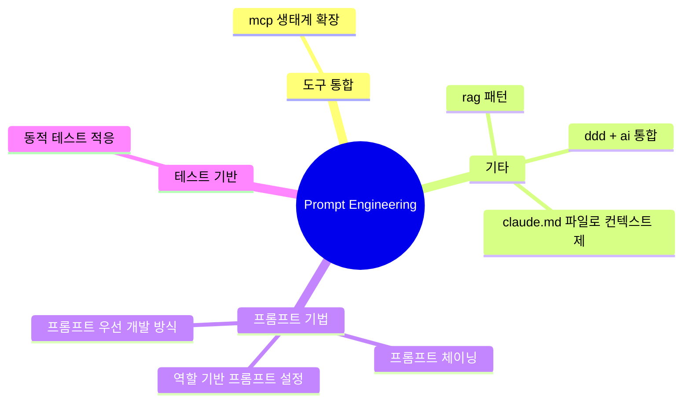

# Prompt Engineering 심층 분석

**생성일**: 2026-01-04
**기법 수**: 272개
**전체 비율**: 19.4%

## 개요

효과적인 프롬프트 작성 기법입니다. STICC, CTA, Few-shot 등 다양한 프롬프팅 패턴과
컨텍스트 엔지니어링 기법을 포함합니다.

---

## 핵심 기법 TOP 10

| # | 기법명 | 출처 수 | 주요 도구 |
|---|--------|--------|----------|
| 1 | mcp 생태계 확장 | 10 | Supabase, Context7 |
| 2 | rag 패턴 | 6 | - |
| 3 | ddd + ai 통합 | 6 | - |
| 4 | 프롬프트 체이닝 | 5 | - |
| 5 | claude.md 파일로 컨텍스트 제공 | 4 | - |
| 6 | vibe coding 리스크 관리 | 4 | - |
| 7 | 컨텍스트 체이닝 (context chaining) | 3 | Claude, ChatGPT |
| 8 | 동적 테스트 적응 | 3 | Obsidian, Smart Composer |
| 9 | 롱 컨텍스트 채팅 | 3 | Cursor AI |
| 10 | 역할 기반 프롬프트 설정 | 3 | - |

## 기법 관계도

## 실무 적용 체크리스트

- [ ] STICC 또는 CTA 프레임워크 적용
- [ ] 컨텍스트 엔지니어링 가이드라인 수립
- [ ] 프롬프트 라이브러리 구축
- [ ] 불확실성 지도(Uncertainty Map) 활용
- [ ] 메타 프롬프트로 프롬프트 품질 개선

## 학습 경로

### 입문 (1-2주)

- **mcp 생태계 확장**: Context7, Taskmaster, Knowledge Graph, Code Context, Spring AI MCP 등 다양한 MCP 서버 ...
- **rag 패턴**: 사용자 질문과 관련된 정보를 지식 데이터베이스에서 검색하여 프롬프트에 추가함으로써 생성형 AI의 환각 현상, 최신 정보 부재, 도메인 지식 부족...
- **ddd + ai 통합**: 용어집 자동 생성, 도메인 분해, Bounded Context 설계, Event Storming...
- **프롬프트 체이닝**: `echo "input" | fabric -p pattern1 | fabric -p pattern2`...
- **claude.md 파일로 컨텍스트 제공**: 루트 디렉토리나 하위 디렉토리에 CLAUDE.md 파일을 배치하여 프로젝트별 설정, 코딩 컨벤션, 기술 스택 정보 등을 Claude Code에 ...

### 중급 (3-4주)

- **vibe coding 리스크 관리**: LLM의 컨텍스트 윈도우가 길어질수록 정확도가 떨어진다는 한계 인식. LLM은 컨텍스트 윈도우의 시작과 끝에서 가장 잘 수행되며, 중간 부분은 ...
- **컨텍스트 체이닝 (context chaining)**: 특정 과거 대화를 명시적으로 참조하여 이전 작업을 기반으로 구축. "지난 화요일 데이터베이스 스키마 논의를 기반으로..."...
- **동적 테스트 적응**: MCP를 통해 GenAI가 사용자 컨텍스트에 따른 애플리케이션의 동적 동작 변화를 이해하고 테스트 플로우를 자동으로 조정합니다....
- **롱 컨텍스트 채팅**: Cursor 설정 > 베타 > 롱 컨텍스트 채팅 활성화, Ctrl/⌘ + .로 모드 전환...
- **역할 기반 프롬프트 설정**: "You are an expert technical writer specializing in writing documentation for so...

### 고급 (5주+)

- **대화 지속 기법**: `claude -c` - 이전 컨텍스트 유지하며 연속 작업...
- **프롬프트 우선 개발 방식**: GPT 생성 시 Instructions를 직접 작성하지 않고, Create 탭에서 대화형으로 GPT에게 프롬프트를 생성하도록 요청...
- **컨텍스트 엔지니어링의 중요성**: 3층 컨텍스트 아키텍처, Memory Bank, Context Pipeline 등으로 AI 효과 극대화...
- **컨텍스트 청크 분할**: 128k 컨텍스트 윈도우라도 주의력(attention) 문제로 청크로 나누어 제공....
- **프롬프트 라이브러리 구축**: 자주 사용하는 프롬프트 패턴을 수집하고 정리하여 재사용 가능한 라이브러리를 만드는 방식...

---

## 관련 도구

- ChatGPT
- Claude
- Cursor
- LangChain

## 전체 기법 목록

272개 기법 펼치기

1. **mcp 생태계 확장**: Context7, Taskmaster, Knowledge Graph, Code Context, Spring AI MCP 등 다양한 MCP 서버 활용
2. **rag 패턴**: 사용자 질문과 관련된 정보를 지식 데이터베이스에서 검색하여 프롬프트에 추가함으로써 생성형 AI의 환각 현상, 최신 정보 부재, 도메인 지식 부족 문제를 해결하는 기법
3. **ddd + ai 통합**: 용어집 자동 생성, 도메인 분해, Bounded Context 설계, Event Storming
4. **프롬프트 체이닝**: `echo "input" | fabric -p pattern1 | fabric -p pattern2`
5. **claude.md 파일로 컨텍스트 제공**: 루트 디렉토리나 하위 디렉토리에 CLAUDE.md 파일을 배치하여 프로젝트별 설정, 코딩 컨벤션, 기술 스택 정보 등을 Claude Code에 전달
6. **vibe coding 리스크 관리**: LLM의 컨텍스트 윈도우가 길어질수록 정확도가 떨어진다는 한계 인식. LLM은 컨텍스트 윈도우의 시작과 끝에서 가장 잘 수행되며, 중간 부분은 오류 발생 가능
7. **컨텍스트 체이닝 (context chaining)**: 특정 과거 대화를 명시적으로 참조하여 이전 작업을 기반으로 구축. "지난 화요일 데이터베이스 스키마 논의를 기반으로..."
8. **동적 테스트 적응**: MCP를 통해 GenAI가 사용자 컨텍스트에 따른 애플리케이션의 동적 동작 변화를 이해하고 테스트 플로우를 자동으로 조정합니다.
9. **롱 컨텍스트 채팅**: Cursor 설정 > 베타 > 롱 컨텍스트 채팅 활성화, Ctrl/⌘ + .로 모드 전환
10. **역할 기반 프롬프트 설정**: "You are an expert technical writer specializing in writing documentation for software projects."
11. **대화 지속 기법**: `claude -c` - 이전 컨텍스트 유지하며 연속 작업
12. **프롬프트 우선 개발 방식**: GPT 생성 시 Instructions를 직접 작성하지 않고, Create 탭에서 대화형으로 GPT에게 프롬프트를 생성하도록 요청
13. **컨텍스트 엔지니어링의 중요성**: 3층 컨텍스트 아키텍처, Memory Bank, Context Pipeline 등으로 AI 효과 극대화
14. **컨텍스트 청크 분할**: 128k 컨텍스트 윈도우라도 주의력(attention) 문제로 청크로 나누어 제공.
15. **프롬프트 라이브러리 구축**: 자주 사용하는 프롬프트 패턴을 수집하고 정리하여 재사용 가능한 라이브러리를 만드는 방식
16. **4: knowledge graph memory**: 세션 간 복잡한 연결 정보와 컨텍스트를 기억하는 지식 그래프 메모리 시스템
17. **도메인 컨텍스트 명시화**: 기술 스택, 아키텍처 패턴, 산업 표준을 상세히 정의하여 일관된 기술 선택 보장.
18. **코드 생성 프롬프트 템플릿**: 언어, 요구사항, 고려사항(오류/엣지/성능) 명시 템플릿
19. **코드베이스 탐색 프롬프트 패턴**: AI에게 기존 프로젝트를 분석 요청할 때 8가지 구조화된 질문(목적, 문제 해결, 컴포넌트, 기술 스택, 구조, 데이터 흐름, 아키텍처 결정, 도메인)을 포함하여 개념적 수준의 이
20. **prd 생성 프롬프트 템플릿**: 구조화된 프롬프트를 사용하여 AI가 체계적인 PRD를 생성하도록 유도하는 기법입니다.
21. **다단계 사고 유도**: XML 구조화 프롬프트를 사용하면 Claude가 복잡한 작업을 여러 단계로 나누어 사고
22. **슬래시 커맨드 활용법**: `/web spring-boot로 crud application을 만드는 방법은?` 형태로 웹 검색과 결합한 질문
23. **기술 면접 준비**: 특정 역할에 대한 기술 면접 준비 - 핵심 주제, 일반적인 기술 질문, 실습 연습 개요 제공
24. **mcp 클라이언트-서버 아키텍처 분리 패턴**: AI 개발자와 서비스 제공자(MCP 서버 개발자)의 역할을 명확히 분리. AI 개발자는 프롬프트 엔지니어링에, 서버 개발자는 도메인 특화 서비스 래핑에 집중
25. **목적별 프롬프트 분리**: YouTube 스크립트 번역, 기술 문서 요약 등 목적별 템플릿
26. **컨텍스트 주입 프롬프트 템플릿**: 검색된 문서와 사용자 질문을 조합하는 템플릿 기반 프롬프트 구성. "확신이 없으면 모른다고 말하라"는 지시로 환각 방지
27. **claude.md 기반 프로젝트 컨텍스트 관리**: 저장소 루트의 CLAUDE.md가 자동 로드되어 프로젝트 이해 기반 제공.
28. **dspy 프레임워크**: 프롬프트를 프로그래밍으로 대체, 모듈화된 AI 시스템 구축
29. **rag - 검색 증강 생성**: 대규모 문서 전체를 LLM에 보내는 대신, 사용자 질문과 관련된 문서 부분만 벡터 유사성 검색으로 추출하여 컨텍스트로 제공
30. **샌드박스 환경에서의 안전한 에이전트 실행**: 파일시스템과 명령 실행 환경에 접근하는 에이전트의 프롬프트 인젝션 등 공격을 허용 가능한 수준으로 제한하기 위한 샌드박스 구축
31. **포괄적 컨텍스트 윈도우 관리**: 프로젝트 컨텍스트와 현재 작업을 명시적으로 설정하여 대화 전반에 일관된 맥락 유지
32. **데이터베이스 스키마 설계 프롬프트**: 애플리케이션, 엔티티, 요구사항 기반 스키마 요청
33. **범용 xml 프롬프트 템플릿**: task/topic/format/tone/persona/audience/input/constraints/goal 등의 요소를 포함하는 표준화된 XML 프롬프트 구조
34. **파일 참조 기반 컨텍스트 제공**: 전체 파일 덤핑 대신 범위가 지정된 파일 참조와 라인 번호 사용.
35. **선제적 성능 분석 프롬프트**: N+1 쿼리, API 응답 시간, 인덱스 누락 체계적 점검.
36. **퓨샷(few-shot) 프롬프트**: 여러 가지 예시를 제공하여 원하는 형식으로 답변 유도
37. **작업 크기별 전략적 접근**: 작업을 쉬움/중간/어려움 세 카테고리로 분류하여 각각 다른 방식으로 AI를 활용 (쉬움: 한 번의 프롬프트, 중간: 계획 모드 후 자동 수락, 어려움: 개발자 주도 페어 프로그래밍
38. **제약 조건(constraints) 명시하기**: "must not" 형태의 제약 조건을 프롬프트에 명확히 정의
39. **한번 끝까지 해보기 (역방향 프롬프트 작성)**: 먼저 기존 방식대로 작업을 완료하고, 그 과정에서 컨텍스트를 학습한 후 역으로 프롬프트를 만드는 방법
40. **롤백 후 컨텍스트 재설정 기법**: AI가 원하는 방향으로 작업하지 않을 때, 코드 수정 대신 롤백하고 컨텍스트를 다르게 제공
41. **질문 역량 강화 (prompt engineering)**: "질문을 잘하는 능력"이 핵심 경쟁력
42. **sticc 프롬프팅 프레임워크**: Situation, Task, Intention, Concern, Calibration의 5가지 요소를 포함한 구조화된 프롬프트
43. **cta (cognitive task analysis) 기반 프롬프팅**: 작업을 입력-처리-출력-다음 행동으로 분해하여 AI에게 위임할 부분을 명확히 정의
44. **불확실성 지도 (uncertainty map)**: AI 응답 하단에 AI가 가장 덜 자신있는 부분을 명시하게 하는 기법
45. **되묻게 하기 (ask-back prompting)**: AI가 더 유용한 응답을 위해 필요한 컨텍스트를 직접 요청하게 하는 기법
46. **프롬프트와 컨텍스트 버전관리**: AI와의 채팅 기록, 구현 계획, 테스트 방법을 모두 파일로 저장하고 Git으로 버전관리
47. **repomix를 이용한 리팩토링**: 코드베이스 전체를 하나의 문서로 만들고, 컨텍스트 큰 LLM에게 리팩토링 계획 수립
48. **메타 프롬프트로 프롬프트 개선**: AI에게 내 프롬프트를 개선하게 하고, 개선 이유도 설명하게 함
49. **claude.md 파일 활용 (context documentation)**: 작업 디렉토리에 claude.md 파일을 생성하여 단위 테스트 실행 방법, 프로젝트 레이아웃 개요, 스타일 가이드 등을 포함시켜 세션 간 상태 공유
50. **시스템 프롬프트에 오늘 날짜 포함**: 일정 관리 AI 에이전트는 오늘 날짜를 정확히 알아야 하므로 프롬프트에 날짜를 동적으로 삽입
51. **requirements 템플릿 작성**: 비즈니스 요구사항, 기능적/비기능적 요구사항을 체계적으로 문서화하여 LLM에게 명확한 스펙 제공
52. **러버 덕 디버깅 with ai**: 증상, 시도한 접근법, 가설을 설명하고 "근본 원인 식별을 위한 5가지 질문" 요청
53. **cmd k 인라인 프롬프트**: Ctrl/⌘ + K로 편집기에서 직접 프롬프트 바 열어 코드 수정 요청
54. **yaml 기반 서브에이전트 템플릿 정의**: name, description, model 필드로 구조화된 설정
55. **베스트 프랙티스 내장 프롬프팅**: OWASP, SOLID, PEP 8 등 표준을 프롬프트에 포함
56. **context7을 통한 실시간 문서 통합**: "use context7" 프롬프트로 최신 문서 삽입
57. **사전 압축 (pre-compact)**: /compact로 컨텍스트 미리 압축
58. **최소 프롬프트로 빠른 프로토타이핑**: 2개 프롬프트로 웹사이트 구현
59. **명확성과 반복 (clarity and iteration)**: 명확한 요청으로 시작하고 프롬프트 수정 반복
60. **ai에게 추가 질문 요청하기**: AI가 필요한 정보를 역으로 질문하도록 유도
61. **아이디어 생성 질문 기법**: "무엇을 놓쳤을 수 있는가?" 질문으로 엣지 케이스 발견
62. **목적 중심 ai 도입 원칙**: "해결하려는 구체적 문제가 무엇인가?" 우선 질문
63. **프롬프트에 효율성 요구사항 명시**: 입력 크기, 원하는 시간 복잡도, 성능 제약을 프롬프트에 명시
64. **1인칭 시선 데이터 활용 (미래 트렌드)**: 스마트 글래스를 통한 사용자 시선/컨텍스트 데이터 활용
65. **빈번한 세션 갱신**: 기능 완료 후 새로운 세션 시작으로 컨텍스트 저하 방지
66. **프롬프트에 응답 형식 제한 명시**: "100 words로 제한" 등 제약조건 프롬프트에 포함
67. **이론 기반 정교한 질문**: 배경 지식과 전문 용어를 활용한 구체적 질문
68. **아키텍처 결정 기록(adr) 생성 요청**: 논의 결과를 ADR 템플릿으로 문서화
69. **코드 설명 요청 프롬프트**: 목적, 단계별 동작, 잠재적 문제점 질문
70. **알고리즘 구현 요청 템플릿**: 함수, 헬퍼, 복잡도 분석, 사용 예제 4요소 포함
71. **클래스/모듈 생성 템플릿**: 생성자, 메인 메서드, private 헬퍼, 캡슐화 체크리스트
72. **단위 테스트 생성 프롬프트**: 정상 입력, 엣지 케이스, 잘못된 입력 3카테고리
73. **sql 쿼리 최적화 프롬프트**: 쿼리, DB 시스템, 테이블 크기 컨텍스트 제공
74. **think harder 지시어**: "Think harder"를 프롬프트 끝에 추가하여 Claude가 더 깊이 사고하도록 유도하는 기법
75. **대화 내보내기 및 컨텍스트 관리**: `/export`, `/compact`, `/clear` 명령으로 대화 내역 관리 및 토큰 최적화
76. **새로운 대화 자주 시작하기 (fresh chat strategy)**: 긴 대화는 컨텍스트 처리량을 증가시켜 메시지 할당량을 빠르게 소모하므로, 새로운 주제마다 새 대화를 시작
77. **질문 배치 처리 (question batching)**: 여러 개의 관련 질문을 하나로 묶어서 한 번에 보내는 기법
78. **mcp 멀티턴 컨텍스트 유지**: DeepSeek MCP를 활용하여 메시지 간 컨텍스트를 유지하면서 대화를 이어가는 기법
79. **세션 간 컨텍스트 연속성 관리**: Plan을 문서로 저장하여 세션이 끊어지더라도 다음 세션에서 기존 계획을 검토하고 보완
80. **컨텍스트 인식 (context awareness)**: 대화 중 사용 가능한 토큰을 실시간 추적하여 토큰 한계 관리를 자동화
81. **before/after 비교 패턴**: 일반 프롬프트와 구조화된 XML 프롬프트를 비교하여 개선점을 확인하는 학습 방법
82. **ctrl+g 프롬프트 편집기 활용**: 구성된 텍스트 에디터에서 프롬프트를 편집한 후 Claude에게 전송
83. **시스템 프롬프트 최적화**: 시스템 프롬프트를 1.4k 토큰 감소시켜 컨텍스트 윈도우 공간을 확보
84. **시스템 프롬프트를 통한 컨텍스트 설정**: Claude.md 파일을 생성하여 전역 시스템 프롬프트로 활용
85. **템플릿 기반 구조화 프롬프팅**: 미리 정의된 템플릿을 제공하여 AI가 일관된 형식으로 콘텐츠를 생성
86. **이전 컨텍스트 활용 업데이트**: AI가 기존 다이어그램이나 문서의 컨텍스트를 활용하여 전체 재생성이 아닌 점진적 업데이트
87. **코드베이스 컨텍스트 분석 자동화**: Claude Code가 전체 코드베이스를 스캔하여 컴포넌트, 서비스, 관계를 자동으로 식별
88. **오케스트레이터 패턴**: 스킬 프롬프트는 라우팅 로직만 담당하고, 상세 문서는 references에, 기계적 작업은 scripts에 분리
89. **pda 적용 의사결정 프레임워크**: 4가지 질문으로 PDA 적용 여부 결정
90. **구체적 프롬프트 작성 (specific prompt engineering)**: 프롬프트가 구체적일수록 결과가 더 좋습니다. 특정 클래스나 패턴을 명시적으로 언급하거나 프로젝트의 명명 규칙에 대한 지식을 공유하면 더 정확한 결과를 얻을 수 있습니다.
91. **계획 우선 개발 (planning first development)**: AI 코딩을 시작하기 전에 Figma, v0.ai 등을 활용해 시각적 프로토타입을 먼저 제작합니다. 최소 10-15개의 프롬프트를 사용하여 원하는 디자인에 근접하게 만든 후 코딩에
92. **cursor rules 프롬프트 템플릿 활용**: cursor.directory 사이트에서 사용 중인 기술 스택에 맞는 프롬프트 템플릿을 가져와 프로젝트 루트의 `cursor.rules` 파일에 적용합니다.
93. **스타터 템플릿 활용**: 인증, 데이터베이스, 결제 시스템 등 공통 기능이 이미 구현된 스타터 템플릿을 활용하여 새 프로젝트를 시작합니다.
94. **rag 워크플로우 (obsidian 노트 컨텍스트 활용)**: Obsidian vault를 Cursor에서 열고, `@` 멘션을 통해 파일/폴더를 AI 대화에 포함시켜 개인 지식베이스 기반 RAG를 구현합니다.
95. **codebase indexing 활용**: Cursor의 `codebase` 기능을 활용하여 전체 vault/프로젝트를 인덱싱하고, 자연어 질문으로 관련 문서를 검색합니다.
96. **prompt generator 활용**: OpenAI Playground나 Anthropic Console을 사용하여 System Instructions를 설정하고 프롬프트를 테스트합니다.
97. **대화 중 문서 전환 (동적 컨텍스트 전환)**: AI와 대화를 진행하다가 특정 문서를 `@`로 멘션하여 참조 문서를 동적으로 변경합니다.
98. **이미지 기반 ui 생성**: Webflow 템플릿이나 직접 그린 스케치 이미지를 AI에 첨부하여 동일한 디자인을 생성하도록 요청합니다.
99. **점진적 ui 개선 프롬프트 시퀀스**: UI를 한 번에 완성하지 않고 초기 UI → 섹션 추가 → 애니메이션 → 디자인 개선 순서로 점진적으로 요청합니다.
100. **언제 멈출지 아는 것 (when to stop prompting)**: AI가 문제를 해결하지 못할 때 프롬프트를 계속 시도하는 대신, 직접 해결하기로 전환하는 시점을 판단하는 능력이 중요합니다.
101. **매몰 비용 오류 인식 (sunk-cost fallacy awareness)**: "한 번만 더 프롬프트를 시도하면 될 것 같다"는 생각으로 계속 시간을 투자하는 심리적 함정을 인식해야 합니다.
102. **비결정적 특성 인식 및 방향 수정**: AI의 비결정적(non-deterministic) 특성을 이해하고, 같은 프롬프트에도 다른 결과가 나올 수 있음을 인지합니다.
103. **프롬프트 엔지니어링 역량 구축**: AI 도구의 효과는 프롬프트 품질에 크게 좌우됩니다. 비즈니스 맥락과 사용자 요구사항을 AI에게 명확하게 전달하는 능력을 개발해야 합니다.
104. **타입 안전 프롬프트-코드 연동**: 프롬프트와 수동 작성 코드가 강타입 도메인 모델을 통해 깔끔하게 상호작용합니다.
105. **타입 안전 프롬프트 (type-safe prompts)**: Kotlin 데이터 클래스나 Java 레코드를 사용하여 풍부한 도메인 모델을 구축하고, 프롬프트를 타입 안전하게 구성합니다.
106. **템플릿 기반 에이전트 프로젝트 생성**: 단일 명령어로 JVM 기반 AI 에이전트 프로젝트를 생성할 수 있습니다.
107. **ai 세션 압도 시 중단 및 재시작**: AI 코딩 세션에서 진행 상황에 압도당한다고 느낄 때 세션을 중단하고, 프롬프트를 수정하여 새 세션을 시작합니다.
108. **ai 코딩 어시스턴트에 커스텀 규칙 설정**: 팀의 좋은 관행을 코드화한 프롬프트 지침을 반복적으로 개선하여 AI의 실수를 완화합니다.
109. **ai의 광범위한 접근 방지**: 기능의 작동하는 수직 조각(vertical slice)으로 시작하도록 프롬프트에서 명시적으로 지시합니다.
110. **패턴(pattern) 기반 프롬프트 템플릿화**: 자주 사용하는 프롬프트를 "패턴"으로 저장하여 재사용합니다. CLI에서 `-p` 옵션으로 즉시 호출 가능합니다.
111. **다중 프롬프트 체이닝 워크플로우**: 여러 프롬프트를 파이프(`|`)로 연결하여 복잡한 AI 워크플로우를 구성합니다.
112. **프롬프트 품질 향상 (improve_prompt)**: 작성한 프롬프트를 입력하면 더 명확하고 효과적인 프롬프트로 개선해줍니다.
113. **커스텀 인스트럭션(custom instructions) 설정**: 프로젝트별로 AI에게 컨텍스트를 제공하는 설정 파일을 작성합니다.
114. **전체 코드베이스 컨텍스트 탐색**: 특정 파일만 지정하는 방식 대신 코드베이스 전체를 탐색하여 숨겨진 의존성까지 파악합니다.
115. **로컬 환경에서의 llm 모델 비교 평가**: Open Web UI의 다중 모델 선택 기능을 활용하여 동일한 프롬프트로 여러 AI 모델의 응답을 동시에 비교합니다.
116. **멀티 ai 프롬프트 체이닝**: Claude → GPT → Claude Opus4 협업
117. **재사용 가능한 프롬프트**: 패턴 기반 CLI 파이프라인
118. **고무 오리 디버깅의 진화형 활용**: AI를 "실제로 대답하고 당신보다 더 많이 알고 있는 고무 오리"로 활용. 더 많은 컨텍스트를 제공할수록 더 좋은 결과.
119. **why 중심의 학습 요청**: AI에게 구현 방법(HOW)뿐만 아니라 왜 그렇게 작동하는지(WHY)를 함께 질문하여 이해도 향상.
120. **promptrunner를 활용한 구조화된 출력**: `PromptRunner.usingLlm().createObject(prompt, TargetClass.class)` 패턴으로 LLM 응답을 Java 객체로 직접 매핑
121. **프롬프트 템플릿 외부화**: `src/main/resources/prompt-templates/` 디렉토리에 프롬프트 별도 관리, `@Value`로 주입
122. **ui 생성 및 통합 프롬프트 패턴**: `Implement web UI on top of the CRUD API, build the frontend code and integrate...`
123. **레거시 프로젝트 기능 추가 프롬프트 패턴**: `What would it take to add [기능] functionality to the [프로젝트명] application...`
124. **@symbol 참조를 활용한 정확한 컨텍스트 지정**: `@symbol:AlgorithmController`처럼 코드 심볼 직접 참조
125. **다단계 구조화된 프롬프트 작성**: 복잡한 작업을 번호가 매겨진 단계로 분리하여 요청
126. **컨텍스트 관리를 통한 정확도 향상**: 파일, 폴더 또는 이미지를 컨텍스트로 추가
127. **여러 파일에 걸친 리팩토링 요청**: 한 번의 프롬프트로 다중 파일 변경 요청, diff로 검토
128. **상세한 요구사항 명세 프롬프트**: REST API 생성 시 엔드포인트별 기능, 예외 처리 로직, 기본값 설정, 사용 기술 스택을 명확히 기술
129. **기존 api 문서 활용**: Postman Collection을 컨텍스트로 제공하여 프론트엔드 애플리케이션 생성
130. **프롬프트 템플릿 명명 규칙 변경**: 더 명확하고 일관된 네이밍 컨벤션 적용
131. **입력-출력 비율 인식**: AI 프롬프트(100단어)로 결과물(1만 단어) 생성하면 '선택'의 본질 사라짐 → 정밀한 제어가 필요하면 충분한 입력 제공
132. **프롬프트 주도 개발(prompt-driven development, pdd)**: - TDD의 원칙을 AI 프롬프트 설계에 적용
133. **promptpex를 활용한 프롬프트 테스트**: - 프롬프트에 대한 테스트 스위트를 자동 생성하는 프레임워크 활용
134. **컨텍스트 인식 개발 지원 활용**: - 전체 아키텍처 패턴을 AI에게 설명
135. **프롬프트의 체계적 보존 (prompt preservation)**: - Vibe Coding 시 생성된 코드만 보관하고 프롬프트를 버리는 것은 잘못
136. **lovable + cursor 에이전트 실험**: - Lovable로 프롬프트 기반 프로토타입 생성
137. **올바른 질문 프레임워크 (리더용)**: - "개발자가 필요 없어질까?" (잘못된 질문)
138. **3: double escape (esc esc) 대화 분기 기법**: 고품질 컨텍스트 구축 후 Double Escape로 대화 분기하여 동일 컨텍스트 재사용
139. **5: 3층 컨텍스트 아키텍처**: 프로젝트 정보를 세 가지 계층으로 구조화
  - Layer 1: Project DNA (아키텍처, 기술 스택, 코딩 표준)
  - Layer 2: Active Context (현재
140. **7: context pipeline approach**: 스크립트로 개발 컨텍스트 자동 수집 및 통합
141. **2: context7을 통한 최신 문서 실시간 주입**: AI가 최신 공식 문서와 코드 예제를 실시간으로 가져와 컨텍스트에 주입
142. **5: 시맨틱 코드 검색 (code context mcp)**: 자연어 질문으로 코드베이스에서 관련 코드 검색, AST 기반 지능형 청킹
143. **전통적 코딩 + ai 도구 둘 다 마스터**: 코딩 기본기(디버깅, 검증)와 AI 도구(프롬프트, 오케스트레이션) 모두 필요
144. **프로덕션 코드 기반 질의 패턴**: AI에게 일반적인 코드 패턴 대신 실제 검증된 구현 예제를 요청하는 프롬프트 방식
145. **실제 사용 사례별 프롬프트 패턴**: - **인증 구현**: "적절한 에러 관리를 포함한 OAuth 새로고침 토큰 처리의 프로덕션 예제를 찾아줘"
146. **프롬프트 포맷팅 패턴**: 멀티라인 문자열과 템플릿 변수를 조합한 구조화된 프롬프트 작성
147. **mcp 서버를 통한 컨텍스트 주입**: `shadcn-ui-mcp-server`를 설치하여 AI에게 컴포넌트 사용 예제, 메타데이터, 블록 정보를 실시간으로 제공
148. **모델 매개변수 최적화**: 컨텍스트 길이, 온도, 응답 형식 조정
149. **불확실성 표시 요구**: "불확실한 부분이 있다면 명시적으로 표시해주세요"
150. **컬렉터-실행자 패턴**: 도구를 컬렉터(컨텍스트 수집)와 실행자(CRUD 작업)로 구분
151. **mcp 서버 내장 프롬프트 활용**: `/fetch`, `/sql` 등 사전 정의된 프롬프트
152. **구조화된 컨텍스트 제공**: XML 태그로 정보 구분 (`<name>`, `<src>`)
153. **소스 코드 일괄 수집 스크립트**: `find` + `cat`으로 전체 컨텍스트 제공
154. **타겟 오디언스 명확화**: 콘텐츠를 "컴퓨터과학 학사, 소프트웨어 공학 석사 수준의 한국 개발자"를 위해 작성하도록 지정하여, 프롬프트의 정확도와 관련성을 높입니다.
155. **문맥 기반 질문 설계**: 특정 노트의 핵심 개념을 추출하도록 유도하는 구조화된 질문.
156. **로컬 llm 실행 최적화**: GPU 오프로드, 컨텍스트 길이, CPU 스레드풀 크기 조정.
157. **ai를 주니어 개발자로 대우**: 명확한 지시와 컨텍스트 제공, 결과물에 대한 검증 필수.
158. **시스템적 워크플로우 구축**: "마법의 프롬프트"보다 재사용 가능한 프로세스가 핵심.
159. **컨텍스트 윈도우 최적화**: 중요 정보 우선 배치, 노이즈 제거, 효과적 구조화로 제한된 컨텍스트 최대 활용.
160. **재사용 가능한 패턴 체계화**: 성공한 PRP 템플릿을 시스템 프롬프트에 통합하여 일관된 품질 보장.
161. **계층적 아키텍처 분석 프롬프트**: 마이크로서비스 경계, 통신, DB 스키마 체계적 파악 + 다이어그램 생성.
162. **자연언어 기반 일상 q&a 패턴**: "결제 처리는 어떻게 동작하나?" 같은 자연스러운 질문으로 온보딩.
163. **패턴 일관성 기반 생성 프롬프트**: 기존 서비스 패턴 분석 후 새 서비스 생성 시 규칙 준수.
164. **재사용 가능한 커스텀 커맨드 라이브러리**: .claude/commands/에 표준화된 작업 템플릿 저장.
165. **도메인 주도 설계(ddd) 접근법**: 서브도메인과 바운디드 컨텍스트 식별, 컨텍스트 맵 작성.
166. **구체성 제공(specificity)**: 일반적 질문 대신 구체적 정보 포함하여 프롬프트 작성.
167. **few-shot learning**: 원하는 결과물의 예시를 미리 보여주어 형식과 톤 유도.
168. **연쇄 프롬프팅(chained prompting)**: 첫 결과물을 두 번째 프롬프트의 입력으로 사용.
169. **simple-to-detailed 프롬프트 계층화**: 단순 요청으로 시작하여 상세한 명세서로 확장.
170. **의도 감지(intent detection) 기반 응답**: 50% 이상 확신 있으면 질문으로 간주하고 답변.
171. **화면 기반 컨텍스트 우선순위화**: 음성과 화면 정보 함께 분석, 상황별 동적 우선순위 조정.
172. **행동 사례 질문 처리**: 사용자 이력 사용하거나 일반 예시로 채우되 검증 불가 팩트 회피.
173. **프롬프트 숨김 및 신원 보호**: 지침 언급 금지, 정체에 대해 간단히만 답변.
174. **자연어 시나리오 변환 프롬프트**: 자연언어 테스트 시나리오를 구조화된 단계별 지시사항으로 변환.
175. **zapier instruction template 활용**: Zapier가 제공하는 instruction 템플릿을 복사하여 action과 link만 변경
176. **멀티모달 프롬프트 기법 (claude 글쓰기)**: 이미지를 포함한 멀티모달 입력으로 Claude에게 구조화된 글쓰기 요청
177. **제약 조건 명시 프롬프팅 (constraint-based prompting)**: AI에게 코드 생성 시 구체적이고 상세한 제약 조건을 나열하여 원하는 형태의 코드를 정확하게 생성
178. **아키텍처 제약 프롬프팅 (architecture constraint prompting)**: 클래스 구조, 레이어 분리, 의존성 관계 등 아키텍처 수준의 제약을 명시하여 일관된 코드 구조 유도
179. **파레토 원칙(80/20) 적용 전략 프롬프트**: AI를 전문 전략가로 역할 설정하여 목표 달성을 위한 모든 전략을 도출하고, 그 중 80% 결과를 가져올 20% 핵심 전략을 식별
180. **소셜 미디어 콘텐츠 생성 프롬프트**: 플랫폼별 특성을 고려한 바이럴 콘텐츠 생성 요청 기법
181. **영문 교정 요청 간소화**: 간단한 프롬프트로 영문 오류를 체크하는 기법
182. **점진적 개선을 위한 후속 질문 패턴**: AI의 첫 응답에 만족하지 않고 지속적으로 피드백과 후속 질문을 통해 결과물을 개선
183. **claude.md를 guidelines.md로 활용**: claude init으로 생성한 CLAUDE.md를 Junie의 guidelines.md로 복사하여 AI 어시스턴트에게 프로젝트 컨텍스트 제공
184. **탐색적 프롬프팅 (exploratory prompts)**: 프로젝트 이해, 개선 제안, 기능 추천을 위한 오픈형 질문 프롬프트 활용
185. **실행 제한 프롬프팅 (suggest-only prompts)**: AI에게 제안만 하고 실제 구현은 하지 말라고 명시적으로 지시
186. **프롬프트 구성요소 4가지**: 효과적인 프롬프트는 지시(instruction), 질문(question), 문맥(context), 예시(few-shot)로 구성
187. **프롬프트 가독성 향상 - 지시와 예시 분리**: ## 기호를 사용하여 지시, 예시 등을 명확히 구분
188. **프롬프트 리스트 형식으로 나열**: 여러 작업을 번호 매긴 리스트로 명확히 구분
189. **cursor prompt 최적화 기법**: 프롬프트 끝에 "Explain the full approach you'd take to implement this. Just tell, don't code."를 추가하여 전체 계획
190. **원격 근무 준비도 의사소통**: "왜 원격으로 일하고 싶나요?" 질문에 대한 명확하고 설득력 있는 답변 작성
191. **구조화된 콘텐츠 요약 프롬프트 (fabric 스타일)**: 체계적인 단계별 지침으로 텍스트 콘텐츠에서 SUMMARY, IDEAS, INSIGHTS, QUOTES, FACTS 등 섹션별 추출
192. **계획 우선 코딩 프롬프트**: 코드 작성 전 전체 접근 방식을 설명하도록 요청
193. **역할 기반 프롬프트 설정 (role-based prompting)**: AI에게 특정 전문가 역할을 부여하여 전문성과 일관성 있는 응답을 유도
194. **컨텍스트 기반 참조 제공 (context-based reference)**: AI에게 특정 전문 서적이나 방법론을 참조하도록 명시
195. **slow think (슬로우 싱크) 프롬프트 기법**: Chain of Thought보다 4~10% 더 정확한 결과를 제공하는 고급 프롬프트 기법
196. **불확실성 관리 및 정직성**: AI가 자신의 지식 한계를 인지하고, 불확실한 정보에 대해 솔직하게 표현
197. **step-back prompting (한 걸음 물러서기)**: 구체적인 문제에 매몰되기 전에, 관련된 일반 원칙이나 배경 지식을 먼저 활성화
198. **지식 베이스 통합을 통한 컨텍스트 인식 ai 구축**: 벡터 데이터베이스(Chroma)를 활용하여 AI가 프로젝트별 지식과 문서를 참조하도록 구성
199. **다단계 프롬프트**: 지시, 문맥, 예시, 질문 4요소 구조화
200. **자체 데이터 통합 (byod)**: LLM이 학습하지 않은 사용자의 비공개 문서, 제품 정보, 최신 정보 등을 컨텍스트로 제공
201. **ast pattern search**: `search_for_pattern`으로 특정 코드 패턴을 검색하여 정확한 위치 파악. 컨텍스트 라인 포함
202. **ai 기반 bounded context 설계**: 특정 도메인에 대해 경계 컨텍스트를 정의하고, 의존성을 3가지로 분류(의존성 없음/업스트림-다운스트림/상호 의존적)
203. **ai 기반 context map 시각화**: 경계 컨텍스트 간의 관계 유형, 통합 메커니즘, 의존성을 분석하여 PlantUML 다이어그램으로 시각화
204. **ai 기반 전술적 ddd 모델링**: 특정 경계 컨텍스트에 대해 애그리게이트, 엔티티, 값 객체, 리포지토리를 식별하고 정의
205. **ai 기반 event storming**: 경계 컨텍스트 내의 도메인 특화 이벤트를 식별. 각 이벤트에 대해 이름, 설명, 도메인 컨텍스트 정의
206. **ddd 전문가 페르소나 활용**: 모든 프롬프트에서 "Eric Evans의 도메인 주도 설계(DDD) 전문성을 갖춘 소프트웨어 아키텍트로서"라는 역할 부여
207. **ai 초안 + 전문가 검토 협업**: AI가 생성한 초안(용어집, 도메인 모델, 컨텍스트 맵 등)을 전문가가 검토, 도전, 정제하는 협업 워크플로우
208. **반복 질문 비교 기법 (multiple query comparison)**: 같은 질문을 여러 번, 표현을 다르게 바꿔가며 물어보고 답변들을 비교. LLM의 비결정론적 특성 활용
209. **llm 자기 비교 요청 (self-comparison request)**: 여러 번의 질문을 통해 얻은 답변들을 LLM 자체에게 비교 분석하도록 요청
210. **spec as context**: 사양과 프롬프트를 통합된 개념으로 사용. 사양 자체가 구조화된 프롬프트의 일부로 기능
211. **questionansweradvisor 자동 프롬프트 증강**: 사용자 질문에 검색된 관련 문서를 자동으로 컨텍스트로 추가. "Given the context and provided history information, and not prior
212. **dspy 모듈 기반 ai 개발**: 프롬프트 문자열 대신 입출력 동작을 시그니처로 정의하고 모듈로 추상화. `dspy.ChainOfThought("question -> answer: float")`와 같이 선언적 정
213. **bootstraprs 최적화**: `dspy.BootstrapRS`로 각 모듈에 효과적인 few-shot 예제를 자동 합성
214. **miprov2 프롬프트 최적화**: `dspy.MIPROv2`로 각 프롬프트에 더 나은 자연어 지시문을 자동 제안 및 탐색
215. **dspy rag 모듈 구현**: `dspy.Predict("context, question -> answer")`로 RAG 패턴 모듈화. ColBERTv2 등 검색 도구와 연동
216. **설계 문서 컨텍스트 프롬프팅**: Markdown 설계 문서 전체를 AI에게 컨텍스트로 제공하고 명시적 요구사항 기반 코드 생성 유도
217. **cursor rules를 통한 ai 코딩 어시스턴트 커스터마이징**: 프로젝트별 cursor rules 파일을 생성하여 Cursor AI 에디터의 동작을 프로젝트 컨텍스트에 맞게 커스터마이징
218. **prd 기반 태스크 관리**: PRD 템플릿을 활용하여 AI가 태스크를 자동으로 분해하고 관리
219. **intermittent reinforcement awareness**: AI 코딩의 슬롯머신 같은 특성 인식. "한 번만 더 프롬프트를"이라는 충동 인식하고 적절한 휴식
220. **feedback loop iteration**: AI 생성 코드가 불완전할 경우, 오류 메시지와 컨텍스트를 AI에게 피드백으로 제공하여 반복 개선
221. **context file provisioning**: AI가 사용자 정의 코드나 덜 알려진 의존성을 참조해야 할 때, 관련 컨텍스트 파일 함께 제공
222. **ask vs code 모드 구분**: 코드베이스 이해가 필요할 때는 'ASK' 모드로 질문하고, 실제 코드 생성이 필요할 때는 'CODE' 모드를 사용하여 AI 에이전트의 동작을 명확히 구분
223. **로그 배치 처리를 통한 ai 입력 최적화**: 20개 로그를 모으거나 300ms 간격으로 배치 전송하여 AI가 처리하기 적합한 단위로 정보 제공. AI의 컨텍스트 윈도우를 효율적으로 활용
224. **오버라이드 템플릿 거버넌스**: "위험 수용 + 완화책 + 만료일 + 승인자"를 명시한 구조화된 오버라이드 템플릿으로 Staff/EM이 AI 게이트를 투명하게 우회할 수 있도록 하여 유연성과 책임성 균형
225. **도메인 언어 사용**: 프로젝트의 도메인 언어를 사용하여 질문하면 더 정확한 결과를 얻을 수 있음
226. **점진적 탐색 (top-down exploration)**: 넓은 범위의 질문으로 시작한 다음 특정 영역으로 좁혀가는 방식으로 코드베이스 이해
227. **메모리 시스템 (claude.md)**: 프로젝트 메모리(팀 공유), 로컬 메모리(개인 프로젝트별), 사용자 메모리(전역 개인)의 3가지 계층으로 컨텍스트 관리
228. **토큰 효율적 컨텍스트 관리**: 세션 시작 시 각 스킬의 짧은 설명(frontmatter YAML)만 로드하여 수십 개 토큰만 사용하고, 실제 필요할 때만 전체 내용을 불러와 컨텍스트 오염(context poll
229. **코드베이스 질문 우선 접근**: Claude Code 사용 시 코드 작성보다 코드베이스에 대한 질문("이 함수가 왜 이렇게 설계되었나요?", "새로운 로거를 추가하려면?")부터 시작하여 에이전트와 친숙해진 후 코
230. **브라우저-터미널 컨텍스트 브릿징**: AI가 클라이언트 측 상태를 파악할 수 있도록 로그 스트리밍
231. **프로젝트 범위 메모리 격리 (project-scoped memory isolation)**: 각 프로젝트마다 독립적인 AI 메모리 공간을 생성하여 컨텍스트 교차 오염을 방지. 클라이언트 작업, 개인 프로젝트, 연구 등을 별도로 관리하며, 각 프로젝트의 기술 스택, 코딩 표
232. **메모리 시딩 (memory seeding)**: 새 프로젝트 시작 시 기술 스택, 코딩 표준, 클라이언트 선호도, 아키텍처 패턴 등을 명시적으로 문서화하여 AI에게 프로젝트 컨텍스트를 일괄 주입.
233. **구조화된 메모리 추가 (structured memory additions)**: 복잡한 컨텍스트를 구조화된 형식으로 명시적으로 기록. 클라이언트 선호도, 코드 리뷰 표준 등.
234. **dynamic tool loading strategy**: 모든 툴 정의를 컨텍스트에 미리 로드하는 대신, 실제로 필요한 툴만 동적으로 로드.
235. **code-based agent control flow**: 프롬프트 체인 대신 코드로 루프, 조건문, 에러 처리 등의 제어 흐름을 표현.
236. **context-external data processing**: 중간 데이터를 모델 컨텍스트에 포함시키지 않고 코드 실행 환경에서만 처리하여 프라이버시 보호.
237. **컨텍스트 기반 질문 추천 시스템**: 처리된 콘텐츠를 분석하여 카테고리별 의미 있는 질문을 추천.
238. **`@` 기호를 통한 특정 파일 참조**: AI에게 질문할 때 `@` 기호로 특정 파일을 명시적으로 지정.
239. **마크다운 기반 커스텀 명령어 생성**: `.opencode/command/` 디렉토리에 마크다운 파일로 재사용 가능한 AI 명령어 템플릿화. `$arguments` 사용.
240. **context-driven ai guidance**: 모호한 프롬프트 대신 명확한 컨텍스트(명세, 계획, 작업 정의)를 제공하여 AI의 패턴 완성 능력 최대화.
241. **ai 대화형 명세 정제**: 모호한 아이디어를 AI와의 반복적 대화를 통해 포괄적인 PRD로 발전. AI가 명확화 질문 제시, 엣지 케이스 식별.
242. **증거 기반 개발 원칙**: AI가 절대적 표현을 금지하고 확률적 언어 사용. Context7 도구로 공식 문서 조회하는 "연구 우선" 정책.
243. **토큰 경제 최적화 (ultra-compressed mode)**: 기호 언어, 약어, 글머리 기호로 토큰 사용량 70%까지 감소. 컨텍스트 증가 시 자동 활성화.
244. **전문화된 역할 기반 ai 활성화 (9가지 페르소나)**: 아키텍트, 프론트엔드/백엔드 개발자, 보안 전문가 등 9가지 전문 페르소나 정의. 컨텍스트 기반 자동 전환.
245. **컨텍스트 기반 자동 역할 전환**: 파일 확장자, 키워드 감지로 자동 페르소나 활성화. .tsx → frontend, "버그" → analyzer.
246. **mcp context enhancement**: `--c7` (공식 문서), `--seq` (복잡한 분석), `--magic` (UI 생성), `--play` (브라우저 자동화) 플래그.
247. **deep project context loading**: `/load --deep --summary` 명령으로 프로젝트 전체 구조, 의존성, 아키텍처 패턴 종합 이해.
248. **token-efficient configuration with @include template system**: @include 참조 시스템과 YAML 템플릿으로 설정을 모듈화하고 UltraCompressed 모드로 토큰 절감.
249. **git checkpoint support for safe ai-assisted experimentation**: AI와 실험적 작업 시 Git 체크포인트로 컨텍스트 보존, 롤백 용이.
250. **project context loading for consistent ai assistance**: `/load` 명령어로 프로젝트 컨텍스트를 한 번에 로딩하여 AI가 프로젝트 특성 이해.
251. **개인화된 ai 자동화**: 일상 생활 자동화, 컨텍스트 파일 설정 (265)
252. **"무엇"과 "왜" 중심의 명세서 작성**: AI에게 기술적 세부사항 대신 사용자 관점의 목적과 이유를 설명하는 명세서를 작성합니다. 컨텍스트가 더 나은 AI 결정을 이끕니다.
253. **계획 문서 중심 접근법 (plan document-centric approach)**: AI 코딩 도구와 작업할 때 대화가 아닌 계획 문서를 "진실의 소스(source of truth)"로 만드는 방법입니다. 대화 기반 접근법의 컨텍스트 손실 문제를 해결합니다.
254. **컨텍스트 갱신 기법 (context refresh technique)**: 대화가 길어져 컨텍스트 제한에 도달하면, 계획 문서만을 컨텍스트로 새로운 대화를 시작하여 작업을 이어갑니다.
255. **예제 참조 기법 (example reference technique)**: 새로운 기능의 계획 문서를 작성할 때 공식적인 템플릿 대신 이전에 구현된 기능들의 기존 계획들을 참조하도록 합니다.
256. **개인 컨텍스트 파일 설정 (about me file)**: Claude Code가 효과적으로 작동하려면 사용자에 대한 맥락 정보가 필요합니다. 자신이 누구인지, 관심사, 콘텐츠 링크 등을 담은 markdown 파일을 생성합니다.
257. **일일 저널링 ai 에이전트 (daily journal)**: `/daily-checkin` 명령으로 AI가 질문을 통해 일일 저널 항목을 자동 생성합니다.
258. **온톨로지 기반 자연어 쿼리 시스템**: 온톨로지(Ontology) 기반 검색 환경을 구축하여 자연어 질문으로 복잡한 데이터를 조회하고 시각화할 수 있게 함.
259. **clarification questions(명확화 질문) 프로세스**: AI와 대화할 때 "질문이 있으면 명확화를 위해 질문하고, 이후 요청을 진행하라"는 프롬프트를 추가하여 AI가 요구사항을 제대로 이해했는지 확인하는 방법입니다.
260. **memory mode를 통한 컨텍스트 유지**: 프로젝트별 또는 전역 메모리를 저장하여 AI가 프로젝트 컨텍스트를 지속적으로 유지하도록 합니다.
261. **기술 명세 기반 프롬프트 작성**: AI에게 코드 생성을 요청할 때, 언어, 함수명, 파라미터명, 반환값 사양, 테스트 케이스 요구사항 등 구체적인 기술 명세를 프롬프트에 포함시킵니다.
262. **프롬프트를 통한 설계 문서화**: AI 코드 생성에서 프롬프트는 단순한 명령이 아니라 개발자의 사고 과정과 설계를 문서화하는 역할을 합니다.
263. **claude.md를 통한 바이브코딩 환경 구성**: 프로젝트 루트에 CLAUDE.md 파일을 작성하여 Claude Code가 코드베이스를 이해하고 효율적으로 작업할 수 있는 컨텍스트를 제공합니다.
264. **로직 버그 및 엣지 케이스 실패 테스트 프롬프트**: AI에게 "이 코드가 오작동할 때 실패하는 단위 테스트를 작성하라"고 요청하여 잠재적 버그를 사전에 발견합니다.
265. **null/경계값 테스트 프롬프트**: AI가 생성한 코드에 대해 null 값, 빈 문자열, 경계 숫자를 전달하는 테스트를 작성하도록 요청합니다.
266. **부작용(side effects) 검증 테스트 프롬프트**: AI 생성 메서드가 입력 인자를 변경하거나 정적 상태를 수정하는 부작용이 있는지 확인하는 테스트를 작성하도록 요청합니다.
267. **회귀 테스트 및 구현 변경 영향 분석 프롬프트**: "나중에 구현을 변경하면 무엇이 깨질까요?"라고 AI에게 질문하여 유지보수자 관점에서 사고하도록 강제합니다.
268. **동시성/부하 테스트 프롬프트**: AI에게 멀티스레드 또는 부하 테스트를 작성하여 경쟁 조건이나 성능 병목을 식별하도록 요청합니다.
269. **테스트 주도 프롬프트(test-driven prompts) 패턴**: AI가 스스로 자신의 출력물을 검증하고 도전하도록 테스트 작성을 요청하는 워크플로우입니다.
270. **ai 코드 검증 체크리스트 도입**: 6가지 테스트 주도 프롬프트를 팀 전체의 표준 실천 사항으로 도입합니다.
271. **요구사항 도출 질문 기법**: AI에게 "요건 정의에 필요한 질문들을 알려줘"라고 요청하여 AI가 스스로 필요한 정보를 파악하고 질문하도록 유도하는 기법.
272. **ai 기반 맥락적 학습**: 새로운 기술, 라이브러리, 프레임워크를 학습할 때 AI에게 질문하여 빠르게 습득.

