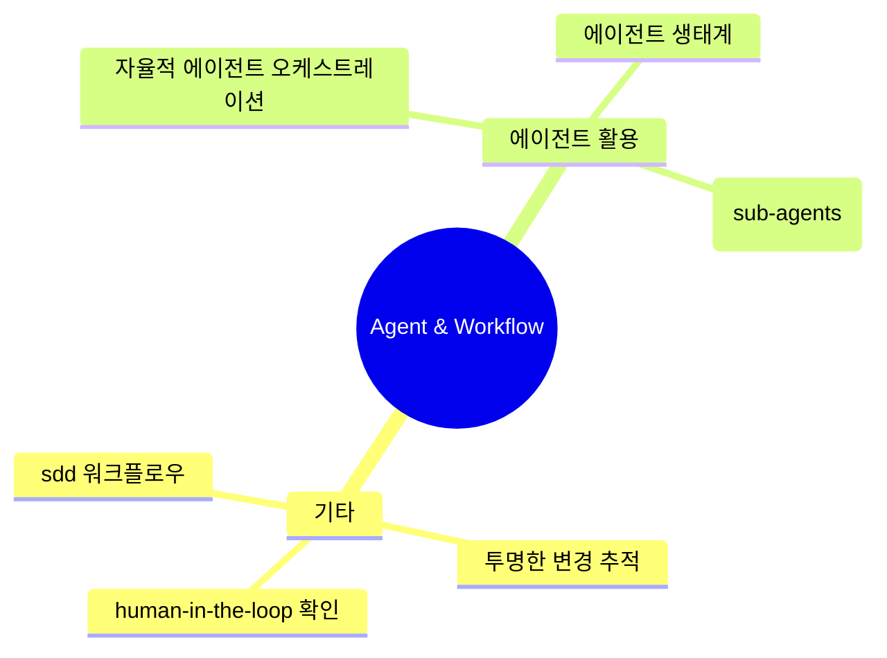

# Agent & Workflow 심층 분석

**생성일**: 2026-01-04
**기법 수**: 187개
**전체 비율**: 13.3%

## 개요

AI 에이전트와 워크플로우 자동화 기법입니다. 서브에이전트 활용, 병렬 처리,
Human-in-the-Loop 패턴 등을 다룹니다.

---

## 핵심 기법 TOP 10

| # | 기법명 | 출처 수 | 주요 도구 |
|---|--------|--------|----------|
| 1 | human-in-the-loop 확인 패턴 | 9 | - |
| 2 | 자율적 에이전트 오케스트레이션 | 5 | - |
| 3 | 투명한 변경 추적 | 4 | - |
| 4 | sdd 워크플로우 | 4 | - |
| 5 | claude.md를 통한 프로젝트 dna 정의 | 3 | - |
| 6 | 컨텍스트 기반 지침 활용 | 3 | - |
| 7 | 파이프라인 통합 | 3 | - |
| 8 | 권한 스킵 모드 | 2 | Cursor AI |
| 9 | 에이전트 생태계 | 2 | - |
| 10 | 80/20 규칙 | 2 | - |

## 기법 관계도

## 실무 적용 체크리스트

- [ ] 서브에이전트 역할 분리 정의
- [ ] Human-in-the-Loop 체크포인트 설정
- [ ] 병렬 처리 워크플로우 구성
- [ ] 에이전트 모니터링 대시보드 구축
- [ ] 롤백 전략 수립

## 학습 경로

### 입문 (1-2주)

- **human-in-the-loop 확인 패턴**: AI 에이전트가 자율적으로 동작하면서도 중요한 결정 지점에서 `WaitFor.formSubmission()` 메서드를 사용하여 사람의 확인을 받...
- **자율적 에이전트 오케스트레이션**: 여러 AI 에이전트를 동시에 조정하여 복잡한 워크플로우를 병렬로 처리. 최대 10개 에이전트를 동시 실행하며 지능적 작업 분산 및 로드 밸런싱 ...
- **투명한 변경 추적**: AI가 생성한 모든 파일과 코드 변경을 인터페이스에서 실시간으로 확인하고, 필요에 따라 개별 변경 사항을 승인하거나 거부할 수 있는 워크플로우 ...
- **sdd 워크플로우**: 자연어 명세서를 작성하면 AI가 실제 작동하는 코드를 자동 생성. 명세→구현 계획→코드 생성. 12시간 → 15분으로 단축....
- **claude.md를 통한 프로젝트 dna 정의**: 아키텍처, 스타일 가이드, 보안 필수통과 조건, 수용 체크리스트를 단일 `CLAUDE.md` 파일에 정의하여 AI 에이전트에게 프로젝트 맥락을 ...

### 중급 (3-4주)

- **컨텍스트 기반 지침 활용**: 'agent.md' 파일에서 제공된 지침을 참조하여 에이전트가 코드베이스 규칙 이해....
- **파이프라인 통합**: `cat file | claude -p "query"` 형태로 Unix 파이프라인에 Claude를 통합하여 자동화된 워크플로우 구축...
- **권한 스킵 모드**: `--dangerously-skip-permissions` 플래그로 권한 확인을 건너뛰어 자동화된 워크플로우 실행...
- **에이전트 생태계**: Sub-agents, Slash-commands, MCP 서버 연동으로 전문화된 작업 분담...
- **80/20 규칙**: 일상 작업은 Slash-commands, 복잡한 작업만 Sub-agents...

### 고급 (5주+)

- **서브 에이전트 (sub-agents) 활용**: 병렬 작업을 분리하여 처리하고, 공유 목표를 향해 작업하는 여러 에이전트를 조정...
- **ai 의존성 승인 워크플로우**: AI가 새로운 패키지나 라이브러리를 추가할 때 자동으로 승인된 의존성 목록과 대조하는 워크플로우를 구축합니다....
- **ai 코드에 대한 자동화된 품질 검사**: SonarQube나 Codescene 같은 도구를 설정하여 코드 냄새에 대해 경고받습니다....
- **원문 병렬 표기**: 기술용어가 처음 나타날 때 "용어 (원문표현)" 형식으로 괄호 안에 영문을 병기합니다....
- **규제 환경 대응**: 에이전트를 stateless로 유지하고, 리뷰 아티팩트(발견사항 + 수용 근거)를 감사용으로 보존하며, 도메인 규칙(PHI, PII, 데이터 거...

---

## 관련 도구

- Claude Code
- Cursor
- LangGraph
- CrewAI

## 전체 기법 목록

187개 기법 펼치기

1. **human-in-the-loop 확인 패턴**: AI 에이전트가 자율적으로 동작하면서도 중요한 결정 지점에서 `WaitFor.formSubmission()` 메서드를 사용하여 사람의 확인을 받는 패턴이다. 에이전트가 프로세스를 
2. **자율적 에이전트 오케스트레이션**: 여러 AI 에이전트를 동시에 조정하여 복잡한 워크플로우를 병렬로 처리. 최대 10개 에이전트를 동시 실행하며 지능적 작업 분산 및 로드 밸런싱 수행
3. **투명한 변경 추적**: AI가 생성한 모든 파일과 코드 변경을 인터페이스에서 실시간으로 확인하고, 필요에 따라 개별 변경 사항을 승인하거나 거부할 수 있는 워크플로우 활용
4. **sdd 워크플로우**: 자연어 명세서를 작성하면 AI가 실제 작동하는 코드를 자동 생성. 명세→구현 계획→코드 생성. 12시간 → 15분으로 단축.
5. **claude.md를 통한 프로젝트 dna 정의**: 아키텍처, 스타일 가이드, 보안 필수통과 조건, 수용 체크리스트를 단일 `CLAUDE.md` 파일에 정의하여 AI 에이전트에게 프로젝트 맥락을 제공하고, "좋은 것 vs 나쁜 것"
6. **컨텍스트 기반 지침 활용**: 'agent.md' 파일에서 제공된 지침을 참조하여 에이전트가 코드베이스 규칙 이해.
7. **파이프라인 통합**: `cat file | claude -p "query"` 형태로 Unix 파이프라인에 Claude를 통합하여 자동화된 워크플로우 구축
8. **권한 스킵 모드**: `--dangerously-skip-permissions` 플래그로 권한 확인을 건너뛰어 자동화된 워크플로우 실행
9. **에이전트 생태계**: Sub-agents, Slash-commands, MCP 서버 연동으로 전문화된 작업 분담
10. **80/20 규칙**: 일상 작업은 Slash-commands, 복잡한 작업만 Sub-agents
11. **서브 에이전트 (sub-agents) 활용**: 병렬 작업을 분리하여 처리하고, 공유 목표를 향해 작업하는 여러 에이전트를 조정
12. **ai 의존성 승인 워크플로우**: AI가 새로운 패키지나 라이브러리를 추가할 때 자동으로 승인된 의존성 목록과 대조하는 워크플로우를 구축합니다.
13. **ai 코드에 대한 자동화된 품질 검사**: SonarQube나 Codescene 같은 도구를 설정하여 코드 냄새에 대해 경고받습니다.
14. **원문 병렬 표기**: 기술용어가 처음 나타날 때 "용어 (원문표현)" 형식으로 괄호 안에 영문을 병기합니다.
15. **규제 환경 대응**: 에이전트를 stateless로 유지하고, 리뷰 아티팩트(발견사항 + 수용 근거)를 감사용으로 보존하며, 도메인 규칙(PHI, PII, 데이터 거주)을 `CLAUDE.md`에 명시하
16. **plans.md 기반 task 분해 워크플로우**: AI에게 plans.md 파일을 먼저 생성하게 하고, 이를 기반으로 task.md를 만드는 계획 중심 접근법
17. **ask 모드 → agent 모드 워크플로우**: 먼저 Ask 모드로 정보를 수집하고, 이 산출물로 프롬프트를 만들어서 Agent 모드에서 실행
18. **반복 업무의 재사용 가능한 함수화**: LLM을 통해 작업하는 워크플로우를 함수 호출처럼 추상화하여 반복되는 업무에 재사용
19. **claude.md/agents.md 지속적 업데이트 기법**: `/init` 후 그대로 두지 않고, 새로운 기능 추가 시마다 AI가 읽는 문서를 수정
20. **병렬 처리를 위한 이슈 자동 생성 기법**: 문서화를 잘 하고 이슈의 parent-sub 관계를 명확히 설정한 후 자동으로 이슈 생성
21. **에이전틱 검색 (agentic search)**: 인덱싱이나 RAG 없이 glob, grep, find 같은 도구로 코드베이스를 인간처럼 탐색
22. **ai 에이전트의 3요소 구성 (두뇌-기억력-툴)**: n8n에서 AI 에이전트는 두뇌(챗 모델), 기억력(메모리), 툴(손, 발 역할)의 세 가지 요소로 구성
23. **ai 체인 vs ai 에이전트 선택**: 업무 순서가 예측 가능하면 AI 체인(안정적), 다양한 요청에 유연하게 대처해야 하면 AI 에이전트(유연함)
24. **주문형 인텔리전스 (intelligence on tap)**: AI와 에이전트를 통해 역량 격차(capacity gap)를 해소하고 즉시 사용 가능한 지식과 역량 확보
25. **인간-에이전트 비율 최적화**: 너무 적은 에이전트는 효율성 손실, 너무 많은 에이전트는 판단력 압도. 최적 균형점 찾기
26. **에이전트 보스 (agent boss) 역할**: 모든 직원이 에이전트를 구축, 위임, 관리하며 자신의 영향력을 증폭시키는 역할 수행
27. **git 워크플로우 자연어 변환**: 복잡한 Git 시나리오를 자연어로 설명하면 단계별 Git 명령어 생성
28. **컨테이너 관리 자동화 (docker-mcp)**: 컨테이너 관리, 로그 검색, 배포 작업 자동화
29. **오피스 문서 자동화 (powerpoint/excel-mcp)**: 프레젠테이션 요점 추출, 스프레드시트 분석
30. **프로젝트 관리 자동화 (jira-mcp)**: 이슈 검색, 진행 추적, 티켓 생성
31. **proactively 키워드 활용**: 서브에이전트 자동 활성화 시점 지시
32. **도메인별 전문가 에이전트 분리**: Frontend, Backend, API, Mobile 등 영역별 분리
33. **언어/프레임워크 특화 에이전트**: Python, JavaScript, iOS 등 특정 플랫폼 최적화
34. **24/7 ai 코딩 워크포스 구축**: 여러 전문 서브에이전트 조합 AI 팀 구성
35. **fine tuning 10단계 워크플로우**: 체계적인 파인튜닝 파이프라인
36. **gemini mcp 에이전트 연동**: 디버깅, 브레인스토밍에 활용
37. **효율성 분석 필수화 워크플로우**: AI 생성 알고리즘의 시간 복잡도 분석 및 Big-O 검토 필수화
38. **백오피스 우선 ai 자동화**: 내부 FAQ 챗봇 → 교육/해커톤 → 제품 AI 적용 순서
39. **워크플로우 재설계 선행**: AI 도입 전 기존 업무 흐름 분석 및 구조화
40. **configuration over code**: 에이전트 구성이 코드보다 중요
41. **mixture of experts**: 하나의 AI가 모든 것을 하기보다 전문화된 에이전트 활용
42. **커스텀 슬래시 명령어**: 반복되는 작업을 슬래시 명령어로 정의하여 재사용 가능한 워크플로우 자동화
43. **명령어 인수 활용 ($arguments)**: 슬래시 명령어에 `$ARGUMENTS` 변수를 사용하여 동적 파라미터를 받는 유연한 자동화 명령어 생성
44. **자동화 시 숨겨진 요청 주의**: 스크립트나 API 통합을 통한 자동화 시, 숨겨진 요청이 증가하여 할당량을 빠르게 소모할 수 있으므로 주의
45. **slash command 활용**: `/do-commit`, `/organize`, `/wrap-up` 등 반복적인 작업을 자동화
46. **체크포인트-커밋 워크플로우**: 체크포인트를 에어백으로, git 커밋을 안전벨트로 사용하는 이중 안전망 워크플로우
47. **claude for chrome extension**: 브라우저에서 직접 Claude를 사용하여 웹 작업을 자동화하는 확장 프로그램
48. **claude agent sdk 활용**: Claude Code를 구동하는 동일한 인프라를 사용하여 복잡한 에이전트를 구축할 수 있는 SDK
49. **백그라운드 작업 유지**: 서버나 빌드 프로세스를 백그라운드에서 유지하면서 다른 작업을 병렬로 수행
50. **플러그인 마켓플레이스 활용**: 단일 명령어로 커스텀 슬래시 커맨드, 특수 에이전트, MCP 서버를 설치
51. **워크플로우 훅 자동화**: 특정 워크플로우 시점에 자동화된 액션을 트리거
52. **인박스 정리 루틴 자동화**: 정기적인 인박스 정리 루틴을 확립하고 AI를 활용하여 새로운 자료를 적절한 카테고리로 분류
53. **living documentation 자동화**: 코드 변경과 함께 문서(다이어그램)가 자동으로 동기화되어 항상 최신 상태를 유지
54. **ai 기반 코드 설명/문서화**: 기존 코드에 대한 설명을 AI에게 요청하여 학습하고, 문서화를 자동화합니다.
55. **하이브리드 개발 워크플로우**: AI와 인간의 강점을 명확히 구분하여 역할을 분담합니다. AI는 반복적인 작업, 인간은 아키텍처 설계, 보안, 확장성 고려를 담당합니다.
56. **목표-조건-행동 기반 에이전트 설계 (goap)**: 에이전트를 Actions(행동), Goals(목표), Conditions(조건), Domain Model(도메인 모델), Plan(계획)의 다섯 가지 핵심 개념으로 구조화합니다.
57. **어노테이션 기반 에이전트 구성**: Spring MVC와 유사한 어노테이션 기반 모델을 사용하여 에이전트 흐름을 정의합니다.
58. **가드레일 주입 (guardrails injection)**: AI 에이전트 플로우의 어느 지점에서든 가드레일을 주입하여 안전성을 확보합니다.
59. **설명 가능한 ai (explainable ai)**: 에이전트가 문제를 해결할 때 왜 그런 선택이 이루어졌는지 설명할 수 있어야 합니다.
60. **에이전트 연합 (agent federation)**: 대규모에서 플로우의 조합 가능성을 통해 에이전트 연합체를 구성합니다.
61. **에이전트 플로우 실행 제어 및 복원력**: 에이전트 플로우의 실행을 관리하고 더 큰 복원력을 도입합니다. 실패 시 재시도, 폴백 전략, 상태 지속성 등을 통해 안정적 운영을 보장합니다.
62. **선언적 에이전트 정의 (annotation 기반)**: `@Agent`, `@Action`, `@AchievesGoal` 어노테이션을 통해 에이전트의 역할, 수행 가능한 액션, 최종 목표를 선언적으로 정의한다.
63. **비동기 프로세스 재개 패턴 (processid 활용)**: `processId`를 통해 일시 중지된 AI 에이전트 프로세스를 식별하고, Human 응답을 받은 후 프로세스를 비동기적으로 재개한다.
64. **에이전트 → mcp 서버 지시 패턴**: MCP 서버가 호출자 에이전트에게 다음에 무엇을 해야 하는지 명시적으로 지시하는 응답을 반환한다.
65. **비동기 병렬 웹 크롤링**: asyncio.gather()를 사용하여 여러 URL을 동시에 크롤링합니다.
66. **감독된 에이전트(supervised agents) 활용**: 에이전트가 파일 읽기/쓰기, 테스트 실행 등을 자동으로 수행하되, 개발자가 각 단계를 승인하는 방식입니다.
67. **ai 제안 코드 충돌 해결 워크플로우**: AI가 제안한 코드와 기존 코드 간의 충돌을 Git 병합 충돌 방식으로 처리합니다.
68. **graphiti**: 시간 인식 지식 그래프로 AI 에이전트에 장기 기억 부여
69. **다중 에이전트 분할**: 요구사항 분석가 → 부트스트래퍼 → 백엔드 디자이너 등 역할 분리
70. **lifecycle hooks**: PreToolUse, PostToolUse, Notification 시점에 커스텀 셸 명령 실행
71. **@agent 어노테이션을 통한 에이전트 선언**: 클래스에 `@Agent(name, description)` 어노테이션으로 에이전트 선언
72. **interactive shell 모드**: `@EnableAgentShell`로 대화형 CLI 활성화
73. **goap 기반 자동 계획 수립**: 워크플로우 명시적 프로그래밍 없이 에이전트가 최적의 실행 경로 자동 결정
74. **rule files 설정**: 프로젝트별 규칙 파일로 에이전트가 코딩 컨벤션 준수하도록 설정
75. **기술 스택 마이그레이션 자동화**: "Switch from Spring Data JPA to JdbcClient" 같은 간결한 명령으로 기존 코드베이스 기술 스택 변경
76. **풀스택 애플리케이션 단계적 생성**: 백엔드(Spring Boot) → 프론트엔드(Angular) 순으로 점진적 개발 워크플로우
77. **백오피스 roi 우선 전략**: 세일즈/마케팅이 아닌 조달, 재무, 운영 등 백오피스 자동화에 우선 투자
78. **jetbrains ai 생태계**: AI Assistant, Junie, Claude Agent의 역할 분담과 guidelines.md를 통한 프로젝트별 가이드라인 설정
79. **embabel agent framework**: Java/Spring 생태계에서 선언적 에이전트 개발
80. **ai 도구 활용 영역 분류**: - 단위 테스트 작성, 문서화 지원, 코드 작성, 에이전트 워크플로우
81. **도메인 객체 기반 에이전트 설계**: Java Record를 사용하여 도메인 모델을 정의하고, AI 에이전트의 입출력 타입으로 활용
82. **상태 저장형(stateful) 에이전트 패턴**: 장시간 실행되는 에이전트가 중간에 사용자 입력을 요청하고, 대기 상태로 전환 후 재개하는 HITL(Human-in-the-Loop) 패턴
83. **어노테이션 기반 액션-목표 연결**: `@Action`, `@AchievesGoal`, `@Export` 어노테이션으로 선언적 에이전트 플로우 구성
84. **processid 기반 에이전트 재개**: 대기 상태의 에이전트를 식별하여 재개하는 패턴
85. **지침 파일을 통한 표준 정의**: 코드 표준, 프로젝트 구조 등을 외부 지침 파일에 정의하여 자동화.
86. **블로그-팟캐스트 변환 워크플로우**: Generate 기능으로 음성 생성 후 Speechify/Descript로 편집하는 멀티포맷 재활용.
87. **다중 모델 조합 워크플로우**: LM Studio + Nomic Embed 조합으로 정확도 향상.
88. **작업 위임 및 비동기 처리 패턴**: 코드 탐색, 버그 수정 등을 AI 에이전트에 위임하고 나중에 결과 확인.
89. **다중 병렬 작업 에이전트 아키텍처**: 원격 에이전트가 여러 작업을 동시에 병렬로 수행하는 인프라.
90. **posix 명령어 기반 도구 연동**: grep, sed 등 표준 UNIX 명령어를 활용한 에이전트 기능.
91. **로컬-클라우드 하이브리드 워크플로우**: 로컬 동기식(Codex CLI) + 클라우드 비동기식(Codex) 통합 개발 환경.
92. **"explore → plan → code → commit" 워크플로우**: 탐색 → 분석 → 계획 수립 → 구현의 단계적 접근.
93. **agentic workflow 패턴**: "먼저 도구로 검증, 모든 단계 완료 후 테스트 코드 생성" 순서 명시.
94. **대상 사용자별 활용 전략**: 역할별(자동화 엔지니어 없는 팀/입문자/프론트엔드 등) 적용 방식 차별화.
95. **gpt 챗봇 단계별 생성 워크플로우**: ChatGPT의 GPT 기능을 활용하여 커스텀 챗봇을 4단계로 생성 (Create → Instructions → Configure → Actions)
96. **gpt actions - 외부 서비스 연동**: GPT를 Zapier, Google Sheets, API 등 외부 서비스와 연결하여 자동화 워크플로우 구축
97. **단계별 워크플로우 지시 (step-by-step workflow)**: 복잡한 작업을 단계별로 분해하고, 각 단계마다 피드백을 요청하도록 설정
98. **스트림 파이프라인 변환 (stream pipeline transformation)**: 전통적인 for loop를 함수형 스타일의 stream pipeline으로 변환하도록 지시
99. **ai 에이전트를 활용한 멀티 툴 통합 워크플로우**: LangChain/LangGraph를 사용하여 여러 도구(Asana, Google Drive, Chroma DB)를 하나의 AI 에이전트로 통합
100. **langchain/langgraph**: 멀티 툴 에이전트 구축
101. **least privilege for ai agents (ai 최소 권한 원칙)**: AI 에이전트에게 작업에 필요한 최소한의 권한만 부여. 기본적으로 읽기 전용 접근, 쓰기 권한은 명시적 승인 후에만 부여
102. **environment separation (환경 분리)**: Dev/Staging/Prod 환경을 물리적/논리적으로 완전히 분리하고, AI 에이전트는 개발 환경에서만 자유롭게 작업하도록 제한
103. **code freeze ai lockout**: 시스템이 "code and action freeze" 상태일 때 AI 에이전트의 작업 권한을 완전히 차단하는 메커니즘
104. **ai + xp 하이브리드 워크플로우**: AI가 코드 생성을 자동화할수록, 페어 프로그래밍, 지속적인 피드백, 작은 배치 배포 등 XP의 실천법을 결합하여 검증되지 않은 로직의 축적 방지
105. **에이전틱 ai 제약 조건 설정**: 여러 자율 에이전트가 코드를 생성, 정제, 출시하는 시스템에서는 명시적인 제약이 없으면 검증되지 않은 로직이 빠르게 쌓임. 의도적인 마찰과 제약 도입 필요
106. **ai 아웃풋 피드백 루프 구축**: AI가 아웃풋을 가속화할수록 품질, 위험, 의도를 관리하기 위한 강한 피드백 루프 필요. 작은 배치, 지속적 통합, 자동화된 테스팅, 공유된 소유권 활용
107. **코드 직접 편집 워크플로우 (direct code editing workflow)**: 단순한 자동 완성을 넘어서, LLM이 소스 코드 파일을 직접 읽고 편집할 수 있는 접근 방식 활용
108. **react (reasoning + acting) 에이전트**: `dspy.ReAct` 모듈로 도구 사용이 가능한 AI 에이전트 구현. 추론하면서 외부 도구 활용
109. **구조화된 markdown 스펙 기반 코드 생성**: 설계 문서를 구조화된 Markdown으로 작성하고, 특정 헤더(`## Class Summary`, `## Members`)를 자동화 훅으로 활용
110. **claude.md 표준 워크플로우 정의**: 프로젝트 루트에 claude.md 파일을 두고 AI가 따라야 할 표준 워크플로우를 정의 - 문제 분석 → 계획 작성(tasks/todo.md) → 사용자 확인 → 실행 → 리뷰 섹
111. **자연어 기반 ai 작업 할당**: "*Claude, please take over task 33*"과 같은 자연어 명령으로 AI 에이전트에게 작업을 할당할 수 있어, 개발자-AI 간 협업을 자연스럽게 구현
112. **에이전트 가이드라인 자동 생성**: 프로젝트 초기화 시 CLAUDE.md, AGENTS.md, GEMINI.md, Copilot 지침 파일을 자동 생성하여 AI 에이전트가 프로젝트 컨텍스트를 즉시 이해하도록 지원
113. **백로그 특화 claude code 에이전트**: 향상된 작업 관리 기능을 제공하는 전용 AI 에이전트를 선택적으로 설치하여 AI 협업 품질 향상
114. **인수 조건(acceptance criteria) 기반 작업 정의**: 각 작업에 명확한 인수 조건을 정의하여 AI 에이전트가 완료 기준을 명확히 이해하고 작업 수행
115. **feedback-driven loops**: 반영(reflection) 에이전트와 비평(critique) 에이전트로부터 차분 및 비판적 피드백을 수신하여 코드 품질을 반복적으로 개선
116. **에이전트 간 메모리 공유**: 모든 에이전트가 지속적인 지식 뱅크를 공유하고 세션 간 메모리를 유지하여, 좌표 시스템을 통해 20% 이상의 토큰 사용량 감소 달성
117. **대화형 repl 모드**: `claude-flow repl` 명령으로 대화형 모드에서 에이전트 생성, 작업 생성, 메모리 쿼리 등을 즉석에서 실행하며 실험적인 워크플로우 구축
118. **실시간 에이전트 모니터링**: 라이브 대시보드를 통해 에이전트 상태, 진행 상황, 성능을 실시간으로 확인하며 복잡한 작업에서 2배 이상의 속도 향상 가능
119. **markdown 기반 에이전트 지침 패턴**: 작업 수행 방법을 설명하는 Markdown 파일만 드롭하고, 안정성/효율성 향상이 필요한 경우에만 추가 스크립트를 포함하는 단순하고 효과적인 에이전트 구성 방법
120. **범용 에이전트로서의 코딩 도구 활용**: Claude Code를 순수 코딩 도구가 아닌 컴퓨터로 달성할 수 있는 모든 작업을 자동화하는 범용 에이전트로 활용 (데이터 저널리즘, 데이터 시각화, 데이터 게시 등)
121. **도메인별 에이전트 구축 패턴**: 특정 도메인(예: 데이터 저널리즘)에 필요한 데이터 소스 이해, 처리 라이브러리, 게시 방법, 스토리 발견 지침, 시각화 구축 방법을 Markdown 파일과 Python 스크립트 
122. **교육/온보딩 자동화**: 프로젝트 아키텍처, 코딩 규칙, 배포 프로세스를 Skills로 만들어 AI 에이전트가 신규 개발자에게 실시간으로 가이드하게 하는 방식
123. **슬래시 명령어로 재사용 가능한 워크플로우 정의**: 마크다운 파일로 작성되는 커스텀 슬래시 명령어를 통해 반복적인 작업(예: 커밋)의 지침과 권한을 사전 정의하여 매번 허가받지 않고 효율적으로 수행
124. **병렬 에이전트 실행 (parallel agent execution)**: 10개의 병렬 에이전트를 각각 독립된 컨텍스트에서 실행하여 토큰 블리드(token bleed)나 메모리 오버랩 없이 순수한 스코프 실행을 달성. 기존 batchtool보다 깨끗하고
125. **중첩 워크플로우 (nested workflows)**: 각 에이전트가 자체적으로 batchtools나 서브프로세스를 생성할 수 있어 워크플로우를 중첩(nesting) 구성 가능. 이는 10개의 완전한 Claude 인스턴스를 동시에 실행
126. **스텁 에이전트 패턴 (stub agent pattern)**: 완전히 구축된 전용 에이전트(플래너, 테스터, 옵티마이저)와 최소한의 메타데이터만 가진 스텁(stub) 에이전트를 혼합 사용. 스텁은 활성화되기를 기다리는 잠재적 능력(latent
127. **자동 에이전트 감지 메커니즘**: Claude Code가 많은 가이드 없이도 언제 어떤 에이전트를 사용해야 하는지 자동으로 감지. 명시적인 호출 없이도 상황에 맞는 에이전트가 활성화됨
128. **스웜 레이어 아키텍처 (swarm layers)**: 64개의 에이전트를 4개의 역할 계층으로 매핑 - 계획(Planning), 조정(Coordination), 리뷰(Review), 최적화(Optimization). 단순 병렬 처리가
129. **공유 메모리 시스템 (shared memory)**: 에이전트 간 정보 공유를 위한 공유 메모리 내장. 독립적 실행과 협업 사이의 균형 유지
130. **에이전트 상태 확인 (agent health checks)**: 각 에이전트의 상태를 모니터링하는 health check 시스템 내장. 프로덕션 환경에서의 안정성 확보
131. **추적성 (traceability)**: 에이전트 실행 흐름을 추적할 수 있는 기능 내장. 디버깅과 시스템 동작 파악에 필수적
132. **claude code 에이전트 시스템 심화**: 서브에이전트, 스웜 레이어, 병렬 에이전트 실행 등 다층적 AI 오케스트레이션
133. **작업 분해 및 병렬 처리**: 큰 작업을 작은 단위로 분해, 서브에이전트 도메인 분리, 병렬 처리로 효율성 향상
134. **virtual me ai agent creation**: 개인의 SNS 활동 내역(YouTube, 블로그, GitHub 등)을 수집하여 자신의 지식과 스타일을 반영한 가상 AI 에이전트를 구축.
135. **ai 워크플로우 캡슐화 및 재사용**: 복잡한 다단계 AI 작업을 하나의 slash command로 캡슐화하여 재사용 가능한 자동화 도구로 제작.
136. **plan agent와 build agent 분리**: AI 에이전트를 계획 단계(Plan Agent)와 실행 단계(Build Agent)로 분리하여 운영. Tab 키로 전환.
137. **`/init` 명령을 통한 프로젝트 구조 분석**: 프로젝트 디렉토리에서 `/init` 실행하면 AI가 프로젝트를 분석하여 `agents.md` 파일 자동 생성.
138. **tmux 기반 ai-개발환경 병렬 운영**: Tmux로 별도의 윈도우/페인에서 AI 에이전트를 실행하고, Neovim과 프로젝트 실행 환경을 다른 페인에 배치.
139. **spec kit cli-driven workflow**: `/specify`, `/plan`, `/tasks` 명령어로 코딩 에이전트를 조정. 각 명령어가 상세한 아티팩트로 변환.
140. **ai 기반 기술 조사 자동화**: AI 에이전트가 라이브러리 호환성, 성능 벤치마크, 보안 영향 등을 자동으로 조사하고 분석.
141. **다중 구현 접근법 탐색**: 동일한 명세에서 다양한 최적화 목표(성능, 메모리, 보안)를 위한 여러 구현 접근법을 병렬로 생성 비교.
142. **전문 에이전트 위임 및 병렬 처리 (/user:spawn)**: 복잡한 작업을 전문 에이전트에게 위임하여 병렬 처리. frontend/backend 에이전트 협업.
143. **다단계 전문가 검토 프로세스**: architect → frontend/backend 병렬 → security/qa 검토 순서의 파이프라인 구성.
144. **세션 인식 워크플로우 학습**: 단일 세션 내에서 개발자의 반복적인 워크플로우를 감지하고 자동화 제안.
145. **prd-to-workflow pipeline**: `/workflow feature.md` 명령으로 PRD를 단계별 구현 계획으로 자동 변환.
146. **parallel task execution with spawn command**: `/spawn` 명령어로 여러 AI 작업을 병렬로 실행.
147. **ai 생성 ui + cli 통합 워크플로우**: v0로 UI를 생성한 후, shadcn CLI를 활용하여 생성된 컴포넌트를 단일 명령어로 코드베이스에 추가하는 통합 워크플로우입니다.
148. **slash command 기반 ai 에이전트 실행**: `/weekly-checkin`, `/daily-checkin`, `/newsletter-researcher` 등의 slash command를 통해 미리 설정된 AI 에이전트를 즉
149. **주간 체크인 자동화 (weekly check-in)**: `/weekly-checkin` 명령을 실행하면 서브 에이전트가 YouTube 구독자, 비즈니스 지표, Twitter 팔로워 등 다양한 데이터를 자동 수집하여 개인 대시보드를 생성
150. **경쟁사 콘텐츠 리서치 자동화**: `/newsletter-researcher` 명령으로 AI 에이전트가 모든 경쟁사 콘텐츠 히스토리를 검토하여 트렌드를 파악하고 콘텐츠 초안을 작성합니다.
151. **일일 브리핑 자동 생성 (daily brief)**: `/daily brief` 명령으로 AI 에이전트가 지난 7일간의 관련 뉴스를 자동 수집하고 요약합니다.
152. **서브 에이전트 활용 병렬 처리**: 복잡한 작업 시 Claude Code가 여러 서브 에이전트를 생성하여 다양한 지표를 동시에 수집하고 처리합니다.
153. **단일 프롬프트 워크플로우 구축**: 복잡한 AI 에이전트 워크플로우를 단일 프롬프트로 설정할 수 있습니다. 초기 설정만 완료하면 이후에는 slash command만으로 모든 기능을 즉시 실행할 수 있습니다.
154. **ai 에이전트 기반 개인화 쇼핑**: AI 에이전트가 사용자의 스타일, 구매 패턴, 선호도를 학습하여 맞춤형 제품 추천부터 자동 재주문, 업체 협상까지 대행하는 방식입니다.
155. **ai 기반 자동 이력서 최적화 및 지원**: 구인구직 분야에서 AI가 각 회사의 Job Description을 분석하고, 사용자의 이력서를 맞춤 수정한 뒤 자동으로 지원까지 완료하는 워크플로우입니다.
156. **ai 에이전트를 통한 검색-구매 프로세스 간소화**: 기존 쇼핑 프로세스(구글 검색 → 사이트 방문 → 제품 비교 → 결제)를 AI 에이전트가 대화 한 번으로 처리하는 방식입니다.
157. **ai 에이전트 기반 여행 계획 및 예약 자동화**: AI가 동행자 구성에 따른 맞춤 여행 일정 작성, 현지 정보 제공, 예약, 예산 관리를 통합 지원하는 방식입니다.
158. **ai 에이전트 기반 데이터 시각화**: 히트맵(Heatmap) 등을 활용하여 주문 위치별 빈도를 자동 시각화하는 에이전트 기능 구현.
159. **ai 기반 업무 효율화 워크플로우**: 기획-조사-분석의 업무 단계에서 AI를 체계적으로 활용하는 워크플로우.
160. **sub-agents를 통한 병렬 작업 처리**: Task 도구를 통해 하위 에이전트를 생성하여 병렬 작업을 처리하는 기법.
161. **hooks를 통한 자동화**: Claude Code의 특정 액션에 반응하여 자동으로 실행되는 스크립트를 정의합니다.
162. **인지 부하 전환**: 구문 → 시스템 사고, 에이전트 조율자 역할 (275, 278)
163. **평문 프롬프트를 통한 노코드 자동화 구축**: 프로그래밍 지식 없이 평문 영어로 복잡한 자동화 워크플로우를 설명하면 Claude Code가 이를 실행 가능한 JSON 워크플로우로 변환한다.
164. **ai 에이전트 기반 다중 서비스 오케스트레이션**: Telegram 트리거, OpenAI 음성 변환, Google Calendar 등 여러 서비스를 AI 에이전트가 통합 조율하는 패턴.
165. **음성 입력을 통한 ai 자동화 트리거**: Telegram을 통해 음성 메모를 수신하고 OpenAI의 음성 인식으로 텍스트로 변환한 후 AI 에이전트가 처리하는 워크플로우.
166. **vps 기반 24/7 ai 에이전트 셀프 호스팅**: Hostinger VPS 등을 활용하여 n8n과 AI 에이전트를 자체 호스팅하는 방법.
167. **접근성 트리 기반 브라우저 자동화**: Playwright MCP는 스크린샷 기반 시각적 해석 대신 브라우저의 접근성 트리를 활용하여 빠르고 안정적인 성능을 보장합니다.
168. **claude agent sdk 기반 ai 에이전트 개발**: Claude Agent SDK Typescript를 사용하여 목표 달성을 위해 최대 10번까지 멀티 턴 대화를 자동으로 수행하는 자율적 에이전트를 만들 수 있습니다.
169. **sub-agent 및 slash command 패턴**: github-issue-planner, github-issue-manager 등 특화된 서브에이전트를 구성하고, 슬래시 커맨드로 복잡한 워크플로우를 단일 명령으로 실행합니다.
170. **github issue 기반 tdd 자동화**: GitHub 이슈를 생성하면 서브에이전트가 이슈와 코드베이스를 탐색한 후 TDD 방식으로 자동 개발합니다.
171. **ai 에이전트 오케스트레이션 (agent orchestration)**: 개발자가 여러 AI 에이전트(DEVELOPER → REVIEWER → VERIFIER → GIT-MANAGER)를 조율하고 관리하는 워크플로우.
172. **독립적 컨텍스트 윈도우 활용**: 각 AI 서브 에이전트에 별도의 컨텍스트 윈도우를 할당하여 컨텍스트 오염 없이 병렬 작업을 수행합니다.
173. **에이전트 성격 설계 (agent personality design)**: 각 AI 에이전트의 역할, 행동 방식, 품질 표준을 정의하는 "성격"을 설계합니다.
174. **멀티 에이전트 품질 게이트 (multi-agent quality gates)**: QA를 전체 개발 "심포니"의 통합적 부분으로 운영합니다.
175. **핸드오프 관리 (handoff management)**: 여러 AI 에이전트 간의 작업 전달을 설계하고 관리하는 기법.
176. **ai 생성 콘텐츠 검증 워크플로우**: AI가 생성한 콘텐츠에 대해 모든 URL의 정확성을 수동으로 검증하는 human-in-the-loop 방식을 적용합니다.
177. **mcp 서버를 활용한 반복 작업 자동화**: MCP 서버를 구축하여 반복적인 수작업을 자동화합니다.
178. **기존 도구와 ai의 결합 활용**: AI 도구는 기존 개발 워크플로우를 대체하는 것이 아니라 향상시키는 방식으로 활용합니다.
179. **agent swarm 오케스트레이션**: claude-flow를 사용하여 5개의 AI 에이전트가 병렬로 협업하며 서로 다른 역할을 분담합니다.
180. **readme 기반 프로젝트 정의**: README.md 파일에 아이디어와 구현 개요를 먼저 작성하고, AI 에이전트가 분석하여 상세한 기술 구현 계획을 자동으로 생성합니다.
181. **계획 우선 실행 (plan-first execution)**: AI 에이전트에게 먼저 /plans 디렉토리에 상세한 구현 계획을 작성하게 합니다.
182. **에이전트 조율자(orchestrator) 역할**: 개발자의 역할이 "코드 작성자"에서 "에이전트 조율자"로 전환됩니다.
183. **적정 ai 리소스 투자 전략**: 복잡한 AI 에이전트 프로젝트를 위해 충분한 API 크레딧과 높은 요금제가 필요합니다.
184. **문서 기반 단계적 개발 워크플로우**: "요구사항 정의 → 설계 문서 → 체크리스트 → 실제 코딩"의 체계적인 프로세스를 따르는 AI 협업 개발 방식.
185. **ai 90% 코드 생성 워크플로우**: AI가 코드의 대부분(90%)을 작성하고 개발자가 검토, 가이드 제공, 수정을 담당.
186. **병렬 옵션 탐색 (optionality)**: AI를 활용하여 다양한 구현 경로를 적은 비용으로 병렬로 탐색.
187. **에이전틱 ai appsec 어시스턴트 도입**: 자율적 예방과 실시간 문제 해결을 수행하는 AI 에이전트를 AppSec 워크플로에 도입.

