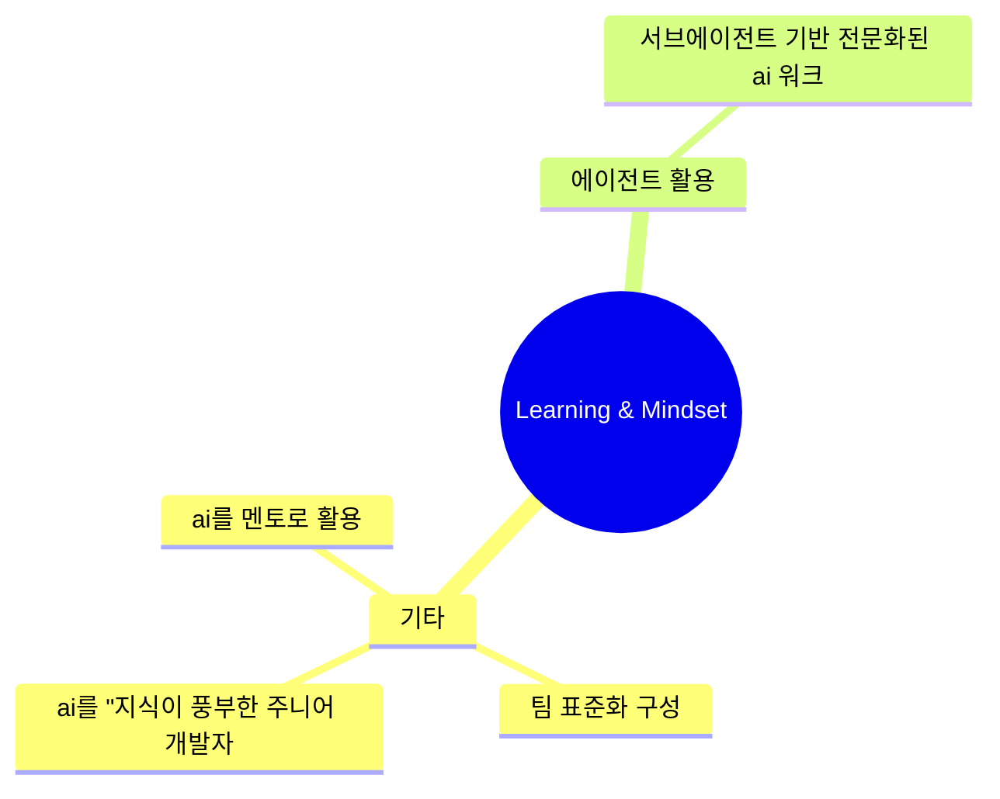

# Learning & Mindset 심층 분석

**생성일**: 2026-01-04
**기법 수**: 69개
**전체 비율**: 4.9%

## 개요

AI 시대의 학습 방법과 마인드셋입니다. 역량 개발, 팀 협업,
AI 활용 문화 구축에 관한 기법들을 포함합니다.

---

## 핵심 기법 TOP 10

| # | 기법명 | 출처 수 | 주요 도구 |
|---|--------|--------|----------|
| 1 | ai를 멘토로 활용 | 4 | Claude, ChatGPT |
| 2 | 팀 표준화 구성 | 4 | Cursor AI |
| 3 | ai를 "지식이 풍부한 주니어 개발자"로 인식 | 2 | - |
| 4 | ai 페어 프로그래밍 방식 | 2 | - |
| 5 | ai 정기 교육 프로그램 | 2 | - |
| 6 | ai 활용의 경계 | 2 | - |
| 7 | 추상화 레벨 상향 | 2 | - |
| 8 | 페어 프로그래밍 마인드셋 적용 | 1 | - |
| 9 | skills 기반 능력 확장 | 1 | - |
| 10 | 클라우드 gpu 활용 | 1 | AWS EC2 GPU, Google Cloud ML |

## 기법 관계도

## 실무 적용 체크리스트

- [ ] 팀 AI 활용 가이드라인 수립
- [ ] 정기 AI 도구 교육 일정 수립
- [ ] 베스트 프랙티스 공유 채널 운영
- [ ] 학습 시간 할당
- [ ] 실험 문화 장려

## 학습 경로

### 입문 (1-2주)

- **ai를 멘토로 활용**: 기능 구현 후 "시니어 엔지니어처럼 내가 작성한 기능과 코드를 상세히 설명해달라"는 프롬프트로 코드 학습 및 이해도 향상...
- **팀 표준화 구성**: `claude --config-file team-config.json`...
- **ai를 "지식이 풍부한 주니어 개발자"로 인식**: AI를 마법같은 코드 생성기로 대하지 말고, Stack Overflow 데이터베이스 전체를 외운 주니어 개발자라고 생각. 기대치 조정이 효과적인...
- **ai 페어 프로그래밍 방식**: AI를 최종 검토자가 아닌 제안자로 취급합니다. 개발자가 AI의 제안을 비판적으로 검토하고 최종 결정을 내리는 협업 방식을 채택합니다....
- **ai 정기 교육 프로그램**: AI 도구가 발전함에 따라 모범 사례도 함께 발전합니다. 개발팀에 정기적인 AI 활용 교육을 제공합니다....

### 중급 (3-4주)

- **ai 활용의 경계**: 핵심 역량 훈련은 AI로 대체하지 말 것, 보일러플레이트 작업에 집중...
- **추상화 레벨 상향**: 개별 파일 변경 → 전체 PR 변경 → 앱 구축 목표 순으로 점점 더 높은 추상화 레벨에서 작업하도록 역량 전환...
- **페어 프로그래밍 마인드셋 적용**: Pull Request 스타일보다 페어 프로그래밍 스타일(높은 빈도의 상호작용, 유동적 역할 교체)로 LLM과 작업할 때 더 효과적입니다....
- **skills 기반 능력 확장**: AI 모델에 새로운 능력을 부여할 때 Markdown 파일과 YAML 메타데이터, 선택적 스크립트를 폴더 형태로 제공하여 모델이 특정 작업 수행...
- **클라우드 gpu 활용**: AWS나 Google Cloud의 GPU 인스턴스를 활용하여 딥러닝 학습 가속화...

### 고급 (5주+)

- **pre-built ai 서비스 활용 패턴**: 전문가 없이 기존에 학습된 AI 서비스를 API로 호출하여 프로젝트에 즉시 적용...
- **ai와의 협업 워크스타일 전환**: AI를 "동료"로 인식하고 협업하는 방식으로 업무 패러다임 전환...
- **포트폴리오 기반 역량 증명**: 학위나 경력보다 실제 성과물(포트폴리오)로 역량을 증명...
- **린 제조업 마인드셋 (lean manufacturing mindset)**: 재고를 부채로 간주하는 린 제조업처럼, 코드도 재고로 인식하여 최소화 추구...
- **워크 차트 (work chart) 모델**: 기능 중심 조직도 대신 목표 중심으로 팀이 구성되는 역동적 모델. 영화 제작처럼 프로젝트별 맞춤형 팀 구성...

---

## 관련 도구

- Notion
- Obsidian
- Documentation Tools

## 전체 기법 목록

69개 기법 펼치기

1. **ai를 멘토로 활용**: 기능 구현 후 "시니어 엔지니어처럼 내가 작성한 기능과 코드를 상세히 설명해달라"는 프롬프트로 코드 학습 및 이해도 향상
2. **팀 표준화 구성**: `claude --config-file team-config.json`
3. **ai를 "지식이 풍부한 주니어 개발자"로 인식**: AI를 마법같은 코드 생성기로 대하지 말고, Stack Overflow 데이터베이스 전체를 외운 주니어 개발자라고 생각. 기대치 조정이 효과적인 협업의 핵심.
4. **ai 페어 프로그래밍 방식**: AI를 최종 검토자가 아닌 제안자로 취급합니다. 개발자가 AI의 제안을 비판적으로 검토하고 최종 결정을 내리는 협업 방식을 채택합니다.
5. **ai 정기 교육 프로그램**: AI 도구가 발전함에 따라 모범 사례도 함께 발전합니다. 개발팀에 정기적인 AI 활용 교육을 제공합니다.
6. **ai 활용의 경계**: 핵심 역량 훈련은 AI로 대체하지 말 것, 보일러플레이트 작업에 집중
7. **추상화 레벨 상향**: 개별 파일 변경 → 전체 PR 변경 → 앱 구축 목표 순으로 점점 더 높은 추상화 레벨에서 작업하도록 역량 전환
8. **페어 프로그래밍 마인드셋 적용**: Pull Request 스타일보다 페어 프로그래밍 스타일(높은 빈도의 상호작용, 유동적 역할 교체)로 LLM과 작업할 때 더 효과적입니다.
9. **skills 기반 능력 확장**: AI 모델에 새로운 능력을 부여할 때 Markdown 파일과 YAML 메타데이터, 선택적 스크립트를 폴더 형태로 제공하여 모델이 특정 작업 수행에 필요한 지침, 스크립트, 리소스에
10. **클라우드 gpu 활용**: AWS나 Google Cloud의 GPU 인스턴스를 활용하여 딥러닝 학습 가속화
11. **pre-built ai 서비스 활용 패턴**: 전문가 없이 기존에 학습된 AI 서비스를 API로 호출하여 프로젝트에 즉시 적용
12. **ai와의 협업 워크스타일 전환**: AI를 "동료"로 인식하고 협업하는 방식으로 업무 패러다임 전환
13. **포트폴리오 기반 역량 증명**: 학위나 경력보다 실제 성과물(포트폴리오)로 역량을 증명
14. **린 제조업 마인드셋 (lean manufacturing mindset)**: 재고를 부채로 간주하는 린 제조업처럼, 코드도 재고로 인식하여 최소화 추구
15. **워크 차트 (work chart) 모델**: 기능 중심 조직도 대신 목표 중심으로 팀이 구성되는 역동적 모델. 영화 제작처럼 프로젝트별 맞춤형 팀 구성
16. **서브에이전트 기반 전문화된 ai 워크포스**: 특정 도메인에 전문화된 여러 서브에이전트를 팀처럼 운영
17. **fine tuning (파인튜닝)**: AI 모델을 특정 분야에 특화되도록 재학습
18. **ai 의존도 조절 (mute ai)**: 학습 단계에서는 기본기 우선, AI 과의존 방지
19. **ai 시대의 개발자 역할 재정의**: AI와 협업하며 발전하는 역할 이해
20. **창의적 파트너로서의 ai 활용**: 아이디어 생성, 선택지 탐색, 설계 개선 협업
21. **베타 테스팅 기반 반복적 개선 문화**: MVP 빠르게 배포 → 사용자 피드백 수집 → 신속한 이터레이션
22. **ai와의 협업자 마인드셋**: "인간 vs 기계"가 아닌 "AI를 잘 활용하는 인간"과의 경쟁으로 관점 전환
23. **실수 기반 학습 업데이트**: AI 실수를 CLAUDE.md 등에 기록하여 반복 방지
24. **ai 시대 개발자 하이브리드 학습 모델**: AI가 코드 생성, 인간이 코드 리뷰와 멘토링 담당
25. **ai 한계 인식 기반 인간 역량 강화**: AI가 대체 어려운 영역(아키텍처, 멘토링)에 집중
26. **renaissance developer**: AI 시대의 다재다능한 개발자 마인드셋
27. **코드베이스 패턴 학습**: 기존 코드베이스의 패턴을 학습하여 일관된 스타일로 정확한 구현을 제공
28. **리포지토리 수준 플러그인 구성**: `.claude/settings.json`에 팀 플러그인을 정의하여 프로젝트 클론 시 자동으로 표준화된 환경 구성
29. **멘토링 자료 구축**: 후배 개발자 지도를 위한 구조화된 지식 베이스를 구축
30. **반복적 디버깅을 통한 skill 개선**: AI가 생성한 결과물의 문제점을 분석하고, Skill 정의를 반복적으로 개선
31. **범용 skill 설계**: 특정 언어나 프레임워크에 종속되지 않고 다양한 코드베이스에서 동작하는 범용 Skill을 설계
32. **스킬 디렉토리 구조 표준화**: `.claude/skills/` 디렉토리 아래 각 스킬별 디렉토리를 만들고 표준 구조로 조직화
33. **skills 시스템**: 마크다운 기반 지식 전달, Progressive Disclosure Architecture, 스킬 조합
34. **도메인 어휘 명시 (ubiquitous language)**: LLM과 작업할 때 팀의 공유 도메인 어휘를 명시적으로 제공하지 않으면, 모델이 의미를 추측해야 하므로 비효율적입니다.
35. **작업 어휘 구축 협업 (growing a language)**: Guy Steele의 개념에 따라, 도메인에서 확립된 개념을 차용하고 잘 알려진 패턴을 활용하여 공유 언어 체계를 형성합니다.
36. **ai 실패를 학습 기회로 전환**: AI가 해결책을 제시하지 못했을 때, 그 과정에서 시스템이 실제로 어떻게 작동하는지 이해하는 기회로 활용합니다.
37. **페어 프로그래밍 방식의 ai 협업**: 엔지니어와 페어 프로그래밍할 때처럼 AI와 협력하여 근본 원인을 찾고, 문제를 이해하며, 수정사항을 반복적으로 개선합니다.
38. **"잘못된 방향" 로그 유지 및 주간 회고**: AI 생성 코드가 팀에 마찰을 일으키거나 유지보수성에 영향을 미친 이벤트를 로그로 유지하고, 주간 회고합니다.
39. **ai 도입 시 팀 문화 관리**: 높은 신뢰와 심리적 안전성을 가진 팀에서 개발자들은 AI 채택의 과제를 공유하고 더 빨리 배울 수 있습니다.
40. **영향 범위별 ai 실수 모니터링**: AI 실수를 세 가지 수준(커밋/팀/코드베이스)으로 분류하여 모니터링합니다.
41. **팀 문화 균형 조성**: AI 회의론자와 열광자 모두를 포용하는 문화를 조성합니다. 현실적인 생산성 향상 기대치는 8-13% 수준입니다.
42. **ai 활용의 경계 설정**: 핵심 역량 훈련(코딩의 설계 능력, 글쓰기의 논리력)은 AI로 대체하지 말 것
43. **ai 시대 필수 역량 개발**: - 비판적 사고력, 문제 해결 능력, 창의성, 학습 마인드셋
44. **ai 위임 원칙 수립**: - 팀 차원에서 "AI에게 무엇을 위임하고 무엇을 절대 위임하지 않을지" 원칙 세트 수립
45. **이론 멘토(theory mentor) 지정**: - 새로운 팀원에게 코드베이스뿐만 아니라 "이론"을 전수하는 멘토 시스템
46. **비대칭 엔지니어링 마인드셋**: "시스템을 구축하는 시스템"을 만드는 사고방식
47. **ai와 협업하는 문제 해결 능력**: 코드 작성보다 시스템 설계, 프롬프트 작성 능력으로 역량 재정의.
48. **단계별 팀 온보딩 로드맵**: 1주차(개인) → 2주차(팀) → 3주차(고급)로 점진적 도입.
49. **예제 기반 학습 (example-based learning)**: Before/After 예제를 제공하여 AI가 원하는 스타일과 품질을 학습하도록 유도
50. **실험 및 워크플로우 관찰 학습법 (experimental learning approach)**: LLM 활용 능력을 높이기 위해 다른 사람들의 워크플로우 세부사항을 관찰하고, 직접 실험하며, 경험 공유
51. **genie metaphor mindset**: AI를 "예측 불가능한 지니"로 인식. 비결정적 특성을 이해하고 대응 전략 수립
52. **experiment-based prototyping**: AI를 활용하여 10배 많은 실험을 빠르게 시도. "완료된 실험을 버리는 것"에 대해 칭찬하는 문화
53. **4단계 학습 사이클**: Plan → Build → Security → Learn의 사이클을 반복하여 개발과 학습을 병행하는 습관 형성
54. **점진적 게이팅 롤아웃 전략**: 섀도우 모드(1주차: 게이트 없이 실행) → 라이트 게이트(2주차: critical만 차단) → 범위 확장(3주차: Playwright, SBOM 추가) → 제도화(4주차: 머지 
55. **조직 암묵지의 명시화**: 경험 많은 개발자의 노하우, 문제 해결 방법, 최적화 전략 등을 Skills로 포착하여 조직 전체가 재사용 가능한 AI 활용 지식으로 전환
56. **기술 기반 위에서의 창의성 발휘**: 코딩 언어, 컴파일러, 런타임, 시스템 설계 등 기술 기반은 여전히 학습해야 하며, 그 위에서 스타트업/제품 아이디어를 구현하는 창의성을 발휘
57. **오케스트레이터 vs 모놀리식 에이전트**: 마스터 에이전트가 조정하는 각각 집중된 강점을 가진 AI 팀 구성. 복잡한 작업을 여러 전문화된 에이전트로 분산
58. **`/share` 명령을 통한 ai 대화 공유**: `/share` (Ctrl+X+S) 명령으로 현재 AI 세션의 URL을 클립보드에 복사하여 팀원과 공유.
59. **pedagogical explanation mode**: `/explain` 명령과 `mentor` 페르소나로 교육적으로 설명. 학습 중심의 상세한 설명 제공.
60. **ai 컴패니언 기반 초개인화 교육**: 평생 동안 학습자와 함께 성장하는 AI 컴패니언 형태의 교육 시스템입니다.
61. **ai 데이터 축적 전략**: 월 100만 건 이상의 상품 처리 데이터를 지속적으로 축적하고, 이를 통해 AI 모델을 학습시켜 4년간 성능을 3배 향상시킴.
62. **아키텍처 중심 ai 협업 (architecture-first ai collaboration)**: AI와 협업할 때 코딩 능력보다 디자인 패턴과 아키텍처적 사고를 우선시합니다.
63. **claude.md 파일을 통한 코딩 가이드라인 제공**: claude.md 파일에 팀의 코딩 가이드라인과 컨벤션을 저장하여 AI가 일관된 코드를 생성하도록 합니다.
64. **학습 및 역량 개발**: AI 기반 맥락적 학습, AI 보안 위험 교육, 하이브리드 역량 개발 (282, 286)
65. **슈퍼 인턴 협업 모델**: AI를 "손이 굉장히 빠른 인턴"으로 비유하여, 빠른 작업 수행 능력을 활용하되 개발자가 관리.
66. **세분화된 ai 협업 개발**: AI와의 협업 시 범위를 좁게 유지하고 한 번에 하나의 동작에만 집중.
67. **빠른 "완료" 증분 전략**: AI와 협업 시 작은 단위의 "완료된" 증분을 신속하게 생산.
68. **협업 마찰 감소를 위한 ai 활용 (autonomous)**: 다수의 팀원과 협업 시 발생하는 마찰을 AI를 활용하여 감소.
69. **하이브리드 기술 역량 개발**: 개발자가 레거시 맥락에서 AI 생성 변경사항을 검증하는 방법을 학습.

