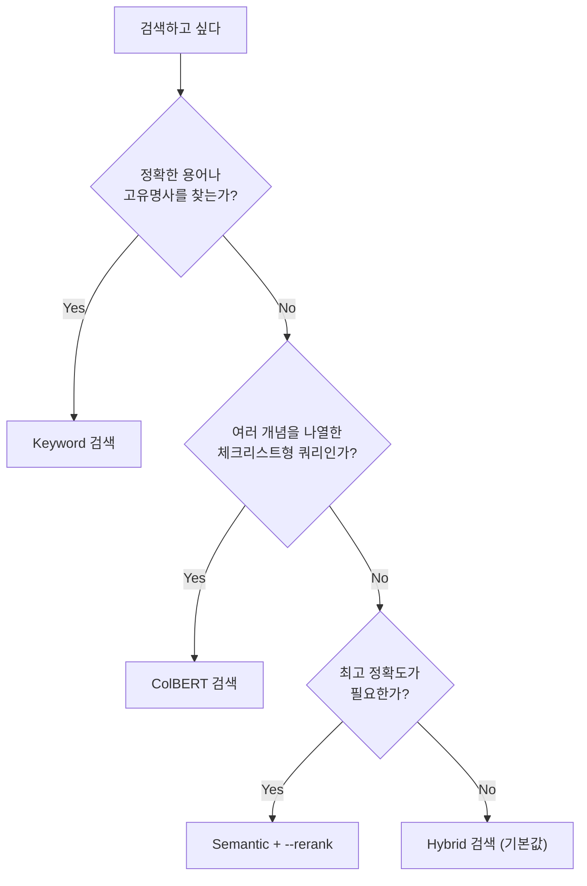

# 검색 방법 비교 가이드

[프로젝트 홈](../../README.md) | [빠른 시작](QUICK_START.md) | [사용자 가이드](USER_GUIDE.md) | [실전 예제](EXAMPLES.md) | [문제 해결](TROUBLESHOOTING.md) | **검색 방법 비교**

---

Vault Intelligence는 4가지 검색 방법을 제공합니다. 이 문서는 각 방법의 원리, 적합한 상황, 사용법을 설명합니다.

## 목차

- [어떤 방법을 쓸까?](#어떤-방법을-쓸까)
- [Keyword 검색](#keyword-검색)
- [Semantic 검색](#semantic-검색)
- [Hybrid 검색](#hybrid-검색)
- [ColBERT 검색](#colbert-검색)
- [옵션 조합 가이드](#옵션-조합-가이드)
- [검색 방법별 최적 쿼리 길이](#검색-방법별-최적-쿼리-길이)

---

## 어떤 방법을 쓸까?



### 비교 요약

| | Keyword | Semantic | Hybrid | ColBERT |
|---|---|---|---|---|
| **비유** | 사전에서 단어 찾기 | 사서에게 주제 설명하기 | 사서 + 사전 동시 활용 | 사서에게 체크리스트 주기 |
| **원리** | 정확한 단어 매칭 (BM25) | 의미 벡터 유사도 (Dense) | Keyword + Semantic 결합 | 토큰별 독립 매칭 |
| **최적 쿼리** | 1-3단어 | 10-15단어 | 5-15단어 | 15-25단어 |
| **속도** | 빠름 | 빠름 | 빠름 | 보통 |
| **정확도** | 중간 | 높음 | 높음 | 높음 |
| **추천 상황** | 고유명사, 파일명 | 개념적 검색 | 일반적 모든 검색 | 복합 개념 검색 |

---

## Keyword 검색

> 사전에서 단어를 찾듯이, 쿼리에 포함된 단어가 문서에 정확히 등장하는지를 기준으로 매칭합니다.

### 원리

BM25 알고리즘 기반의 전통적인 키워드 검색입니다. "TDD"라는 단어가 문서에 직접 포함되어 있어야만 결과에 나타납니다. "테스트 주도 개발"이나 "Red Green Refactor"처럼 같은 개념을 다른 표현으로 쓴 문서는 찾지 못합니다.

### 적합한 상황

- 고유명사를 정확히 찾을 때: `"Kent Beck"`, `"Spring Boot"`
- 파일명이나 특정 용어를 찾을 때: `"SOLID"`, `"YAGNI"`
- 약어(acronym)를 검색할 때: `"TDD"`, `"DDD"`, `"BDD"`

### CLI 사용법

```bash
vis search "SOLID" --search-method keyword
vis search "Kent Beck" --search-method keyword --top-k 10
```

### 강점과 한계

| 강점 | 한계 |
|------|------|
| 가장 빠른 속도 | 동의어/유사 표현을 인식하지 못함 |
| 정확한 용어 매칭에 유리 | "TDD"로 검색하면 "테스트 주도 개발"은 놓침 |
| 결과가 직관적 | 짧은 쿼리에 의존적 |

### 옵션별 효과

- **`--rerank`**: 짧은 키워드 쿼리에서는 **역효과**가 날 수 있습니다. Cross-encoder가 짧은 문서에서 키워드 밀도가 높으면 과대평가하는 경향이 있어, 진짜 전문 문서보다 키워드를 잠깐 언급한 메모가 상위에 올라올 수 있습니다.
- **`--expand`**: **효과적**. 동의어 확장으로 "TDD" → "테스트 주도 개발", "Test Driven Development" 등으로 검색 범위를 넓혀줍니다.

---

## Semantic 검색

> 사서에게 "이런 주제의 책을 찾고 있어요"라고 설명하듯이, 단어가 정확히 일치하지 않아도 의미적으로 유사한 문서를 찾아줍니다.

### 원리

BGE-M3 모델로 쿼리와 문서를 각각 1024차원 벡터로 변환한 뒤, 벡터 간 코사인 유사도(cosine similarity)를 계산하는 Dense embedding 검색입니다. "TDD"로 검색해도 "테스트 주도 개발", "Red Green Refactor" 등 관련 개념을 다룬 문서가 결과에 포함됩니다.

다만 쿼리와 문서 전체를 각각 **하나의 벡터로 압축**하기 때문에, 여러 개념이 하나로 뭉개지는 현상이 발생할 수 있습니다. 넓은 그물을 던지는 만큼 관련 없는 문서(노이즈)가 섞일 수 있습니다.

### 적합한 상황

- 개념적, 의미적 검색: `"테스트 주도 개발 방법론과 설계 개선"`
- 한국어/영어 혼용 검색: `"리팩토링 best practices"`
- 정확한 용어를 모를 때: `"코드를 깨끗하게 유지하는 방법"`

### CLI 사용법

```bash
vis search "테스트 주도 개발 방법론" --search-method semantic
vis search "design patterns for clean code" --search-method semantic --rerank
```

### 강점과 한계

| 강점 | 한계 |
|------|------|
| 동의어/유사 표현 인식 | 노이즈가 섞일 수 있음 |
| 다국어 지원 우수 | 여러 개념이 하나의 벡터로 뭉개짐 |
| 개념 기반 검색 가능 | 짧은 쿼리에서 precision 낮음 |

### 옵션별 효과

- **`--rerank`**: **매우 효과적**. Semantic 검색은 recall(재현율)이 높고 precision(정밀도)이 낮은데, reranker가 정확히 precision을 높여주는 도구입니다. 정보 검색(IR) 분야에서 **"retrieve and rerank"**라고 불리는 표준 패턴이며, semantic retrieval + cross-encoder reranking 조합이 가장 좋은 성능을 보입니다.
- **`--expand`**: 다국어 환경에서 유의미합니다. 한국어 동의어 확장으로 검색 범위가 넓어집니다.

> **Semantic + Rerank가 잘 작동하는 이유**
>
> | 단계 | 역할 |
> |------|------|
> | 1단계 (Semantic) | 넓은 그물 — 의미적으로 유사한 문서를 폭넓게 수집 |
> | 2단계 (Reranker) | 정밀 필터 — 노이즈를 제거하고 진짜 관련 문서를 상위로 |
>
> Semantic이 넓게 수집한 후보에서 Reranker가 노이즈를 걸러내므로, 서로 약점을 보완하는 조합입니다.

---

## Hybrid 검색

> 사전과 사서를 동시에 활용하는 것처럼, Keyword와 Semantic 두 가지 검색을 동시에 수행하여 결과를 통합합니다.

### 원리

Keyword(BM25)와 Semantic(Dense embedding) 두 가지 검색을 동시에 수행한 뒤, 가중 합산으로 결과를 통합합니다.

```
최종 점수 = BM25 점수 × 0.3 + Dense 유사도 × 0.7
```

두 신호가 **상호 검증**하는 효과가 있습니다:
- Keyword에서만 높은 점수를 받은 문서 → 점수 희석
- Semantic에서만 높은 점수를 받은 문서 → 점수 희석
- **양쪽 모두에서 관련성이 높은 문서만 상위에 올라옴** → 노이즈가 자연스럽게 걸러짐

**기본값으로 권장되는 검색 방법**입니다.

### 적합한 상황

- 일반적인 모든 검색 (기본값)
- 키워드와 의미를 모두 활용하고 싶을 때
- 빠르면서도 균형 잡힌 결과가 필요할 때

### CLI 사용법

```bash
# 기본 검색 (hybrid가 기본값)
vis search "TDD Red Green Refactor"

# 명시적으로 지정
vis search "TDD Red Green Refactor" --search-method hybrid
```

### 강점과 한계

| 강점 | 한계 |
|------|------|
| 키워드 + 의미 결합 = 균형 잡힌 결과 | 특화된 단일 방법보다 각 영역에서 약간 뒤질 수 있음 |
| 자체 노이즈 필터링 효과 | |
| 빠른 속도 | |

### 옵션별 효과

- **`--rerank`**: **효과가 작음**. Hybrid는 이미 두 신호의 상호 검증으로 노이즈가 걸러진 상태입니다. Reranker의 주 역할이 노이즈 필터링인데, 이미 깨끗한 결과에 적용하면 순서를 약간 조정할 뿐 큰 변화가 없습니다. 속도 비용 대비 효과가 적으므로 생략해도 됩니다.
- **`--expand`**: 다국어 환경에서 유의미합니다.

> **검색 방법별 Rerank 효과 비교**
>
> | 검색 방법 | 초기 노이즈 수준 | Rerank 효과 |
> |-----------|------------------|-------------|
> | Semantic 단독 | 높음 (짧은 쿼리 시 특히) | **큼** — 노이즈 제거 효과 |
> | Keyword 단독 | 중간 (키워드 빈도 편향) | 중간 (짧은 쿼리에서 역효과 가능) |
> | Hybrid | 낮음 (두 신호가 상호 검증) | **작음** — 이미 깨끗 |
>
> 비유하면:
> - Semantic + Rerank = 넓게 그물을 던진 뒤 수작업으로 골라내기 (효과 큼)
> - Hybrid + Rerank = 이미 정밀 그물로 잡은 것을 다시 골라내기 (효과 작음)

---

## ColBERT 검색

> 사서에게 체크리스트를 주듯이, 쿼리의 각 단어가 독립적으로 문서의 가장 가까운 단어를 찾아 매칭합니다.

### 원리

ColBERT(Contextualized Late Interaction over BERT)는 쿼리와 문서를 각각 **토큰 단위 벡터 집합**으로 표현한 뒤, 각 쿼리 토큰이 가장 가까운 문서 토큰을 찾아 매칭하는 방식입니다.

```
Semantic:  Query → [하나의 벡터]     ↔  Doc → [하나의 벡터]
           "여러 개념이 하나로 뭉개짐"

ColBERT:   Query → [토큰1][토큰2][토큰3]...
           Doc   → [토큰A][토큰B][토큰C]...
           각 쿼리 토큰이 가장 가까운 문서 토큰과 매칭
           "개념별로 독립 매칭 → 합산"
```

Semantic 검색이 문서 전체를 하나의 벡터로 압축하는 것과 달리, ColBERT는 개별 토큰별로 독립 매칭한 뒤 점수를 합산합니다. 이 덕분에 "Kent Beck", "TDD", "Red Green Refactor", "리팩토링" 처럼 여러 개념을 나열한 **체크리스트형 쿼리**에서 강력한 성능을 발휘합니다.

### 적합한 상황

- 여러 개념을 나열한 체크리스트형 쿼리: `"Kent Beck TDD Red Green Refactor 리팩토링 설계 개선"`
- 긴 문장 검색: `"test driven development with refactoring and clean code practices"`
- 복합 개념 검색: `"dependency injection inversion of control spring framework"`

### CLI 사용법

```bash
vis search "Kent Beck TDD Red Green Refactor 리팩토링" --search-method colbert
vis search "clean code refactoring design patterns SOLID" --search-method colbert
```

### 강점과 한계

| 강점 | 한계 |
|------|------|
| 여러 개념이 뭉개지지 않고 독립 매칭 | 다른 방법보다 속도가 느림 |
| 체크리스트형 쿼리에서 최강 | 짧은 쿼리에서는 Hybrid보다 이점 없음 |
| 긴 문장에 최적화 | 초기 인덱싱 시간이 김 (1-2시간, 1회만) |

### 옵션별 효과

- **`--rerank`**: 효과적입니다. ColBERT의 넓은 후보에서 정밀도를 높여줍니다.

---

## 옵션 조합 가이드

### `--rerank` (재순위화)

Cross-encoder(BGE Reranker V2-M3)가 1단계 검색 결과를 정밀하게 재평가합니다. 속도는 느려지지만 정확도가 향상됩니다.

```bash
vis search "검색어" --rerank
```

**검색 방법별 궁합:**

| 조합 | 효과 | 권장 |
|------|------|------|
| Semantic + Rerank | 매우 효과적 (넓은 후보 + 정밀 필터) | 정밀 검색이 필요할 때 |
| ColBERT + Rerank | 효과적 | 복합 개념의 정밀 검색 |
| Hybrid + Rerank | 효과 작음 (이미 깨끗한 결과) | 비용 대비 효과 낮음 |
| Keyword + Rerank | 역효과 가능 (짧은 쿼리 시) | 권장하지 않음 |

### `--expand` (쿼리 확장)

동의어와 HyDE(Hypothetical Document Embeddings)를 활용하여 검색 범위를 넓힙니다.

```bash
# 동의어 + HyDE 모두 사용
vis search "TDD" --expand

# 동의어만 사용 (빠름)
vis search "TDD" --expand --no-hyde

# HyDE만 사용
vis search "TDD" --expand --no-synonyms
```

**작동 방식:**
1. 동의어 확장: "TDD" → "테스트 주도 개발", "Test Driven Development"
2. HyDE: AI가 가상의 관련 문서를 생성하여 의미적 검색 정확도 향상
3. 확장된 쿼리들로 병렬 검색 후 결과 통합

### `--with-centrality` (중심성 점수)

지식 그래프에서의 문서 중요도를 검색 결과에 반영합니다. 많은 문서와 연결된 핵심 문서가 상위에 올라옵니다.

```bash
vis search "TDD" --with-centrality
```

### 권장 조합

| 상황 | 권장 명령어 | 이유 |
|------|------------|------|
| 일반 검색 | `vis search "검색어"` | Hybrid 기본값, 빠르고 충분히 정확 |
| 정밀 검색 | `vis search "검색어" --search-method semantic --rerank` | 넓은 후보 + 정밀 필터링 |
| 정확한 용어 | `vis search "용어" --search-method keyword` | 고유명사, 파일명 등 |
| 포괄적 검색 | `vis search "검색어" --expand` | 동의어 + HyDE로 범위 확장 |
| 복합 개념 | `vis search "개념1 개념2 개념3" --search-method colbert` | 체크리스트형 쿼리 |
| 최고 품질 | `vis search "검색어" --rerank --expand` | 모든 기능 결합 (가장 느림) |

---

## 검색 방법별 최적 쿼리 길이

| 검색 방법 | 최적 쿼리 예시 | 비유 |
|-----------|---------------|------|
| Keyword | `TDD`, `Clean Code` (1-3단어) | 사전에서 단어 찾기 |
| Semantic | `테스트 주도 개발 방법론과 설계 개선` (10-15단어) | 사서에게 주제 설명하기 |
| Hybrid | `TDD Red Green Refactor 사이클` (5-15단어) | 사서에게 주제 + 키워드 함께 전달 |
| ColBERT | `Kent Beck TDD Red Green Refactor 리팩토링 설계 개선` (15-25단어) | 사서에게 체크리스트 주기 |
